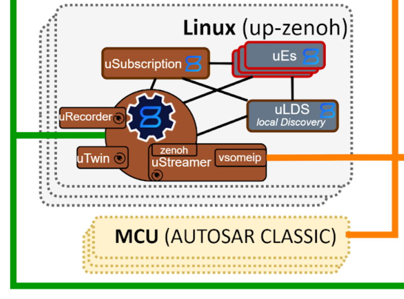

# Interop between C++ vsomeip library and Rust for building uProtocol uTransport

For [uProtocol](https://github.com/eclipse-uprotocol), our Software Defined Vehicle middleware, it was important to be able to incorporate and integrate with mechatronics devices (think brake controllers, IMUs, and so on). There are many mechatronics devices using Classic AUTOSAR frameworks that are updated very infrequently, but serve vital functions within a vehicle. These are hardened controllers which must conform to up to [ASIL-D](https://en.wikipedia.org/wiki/Automotive_Safety_Integrity_Level) standards (the highest level) for safety reasons.

In the Automotive industry, there's been a shift from using [CAN](https://en.wikipedia.org/wiki/CAN_bus) or Controller Area Network over serial communications over to [SOME/IP](https://some-ip.com/) over ethernet in the past decade or so from what I've seen for these sorts of mechatronics devices.

These mechatronics devices are trending towards communicating over SOME/IP and so we targeted to have each high compute device contain a [uStreamer](004-writing-zenoh-plugin.md) which functioned as a bridge between the host transport in [Zenoh](https://zenoh.io/) and the mechatronics devices:



## The Backstory

### The uStreamer

When I joined the uProtocol project there did exist a GM-internal version of the uStreamer written in C++ as well as a C++ uStreamer. I was not super-familiar with the code as the uProtocol project lead [Steven Hartley](https://github.com/stevenhartley) had asked me to work on a few different things, including a uStreamer based solely on reading its [spec](https://github.com/eclipse-uprotocol/up-spec/tree/main/up-l2/dispatchers) (a uStreamer was one of two kinds of dispatchers).

I read and re-read the spec over and over and asked a lot of questions where things didn't seem to quite fit over the next two months or so as I built prototype after prototype of the uStreamer in Rust. It was through these deep dives and reworks of _what_ a uStreamer was and its role within uProtocol that Steven pulled together a clearer concept:

* there should be a generic, pluggable uStreamer library
* there should be a Zenoh plugin into which we write a concrete uStreamer implementation

I set about building the generic, pluggable uStreamer library and [completed this phase](https://github.com/eclipse-uprotocol/up-streamer-rust/pull/8).

### The uP-L1 SOME/IP Transport Library

In parallel [Kai Hudalla](https://github.com/sophokles73) and [Ivan Kirchev](https://github.com/int0x27) were working on two paths for building the [uP-L1 SOME/IP Transport](https://github.com/eclipse-uprotocol/up-spec/blob/main/up-l1/someip.adoc) which would "plug into" the uStreamer to allow us to communicate with mechatronics devices.

#### up-transport-sommr-rust

Our ideal first path was to be able to build on top of the [SommR](https://projects.eclipse.org/projects/automotive.sommr) SOME/IP library written in Rust. Taking this direction made a lot of sense, as this was a fresh, spec-compliant write-up in Rust, which meant fewer concerns about the typical issues with C and C++ of memory safety and thread safety.

Kai worked this path and was ultimately successful in showing the feasibility of building it out and communicating with virtual mechatronics devices.

The issue with this path is that SOME/IP is actually not an open source spec, but one that is maintined by the [AUTOSAR Foundation](https://www.autosar.org/standards/foundation). The SommR team was, from my understanding, working with the AUTOSAR Foundation to open source the SOME/IP spec, but thus far things were moving slowly.

#### up-transport-vsomeip-rust

Our second, less ideal path was to build on top of the [vsomeip](https://github.com/COVESA/vsomeip) SOME/IP library written in C++. You could say this was a more "battle-tested" SOME/IP library, but came with all the inherent risk of situating atop of C++ with memory safety and thread safety concerns.

Ivan worked this path and was able to build out and show how to communicate with mechatronics devices.

The challenge with this path is that Ivan was quite knowledgeable about C++ and vsomeip, he had less Rust experience, so he reported that the interop between C++ and Rust was somewhat difficult and fragile.

#### SOME/IP conclusions

The two parallel paths had more-or-less resulted in a complete show-stopper to the idea of having a Rust uStreamer, as we didn't have a viable path forward for a uP-L1 SOME/IP Transport to be able to plug into it.

### Open-Sourcing of the GM C++ uStreamer

I was asked to take a look through the GM C++ uStreamer and vsomeip transport to vet it for inclusion into the open source Eclipse uProtocol project.

The challenges I saw were multiple:

* uStreamer library didn't exist as a concept; very coupled together with concrete uP-L1 Transport implementations which made adding additional transports and usages outside of this specific topology quite difficult
* Some portions of the uStreamer spec were not implemented correctly, e.g. RPC communications were actually terminated within the uStreamer, with source being rewritten to be the uStreamer rather than the original sender
* up-transport-vsomeip-cpp library which stood on top of vsomeip appeared to have implemented _significantly_ more wrapping of vsomeip than required to expose the UTransport API of `send()`, `registerListener()`, and `unregisterListener()`
* The code quality and maintainability were a bit low for the standards we had set for ourselves in the uProtocol community

From talking with the GM team, we decided that the GM C++ uStreamer and up-transport-vsomeip-cpp would be merged to unblock internal teams within GM, but with the upcoming [up-spec 1.5.8](https://github.com/eclipse-uprotocol/up-spec/releases/tag/v1.5.8) release there would be a ground-up rewrite in C++.

### Pete's Side Project to make up-transport-vsomeip-rust

I had spent several months at this point ensuring that the Rust [uStreamer](https://github.com/eclipse-uprotocol/up-streamer-rust) was spec-compliant and was a bit frustrated that due to the lack of a uP-L1 SOME/IP Transport library in Rust it was going to be more-or-less shelved.

I resolved on nights and weekends to explore how I could try to build a up-transport-vsomeip-rust which I could then plug into the Rust uStreamer. Over the span of roughly 1 1/2 weeks I was able to make a proof of concept to show how we can generate Rust wrappers of key vsomeip functionality in a fairly automated fashion.

Let's now jump into how I went about this.

## vsomeip-sys

As it is in the great tradition of wrapping a non-Rust library in Rust, I named this crate [vsomeip-sys](https://github.com/eclipse-uprotocol/up-transport-vsomeip-rust/tree/main/vsomeip-sys).

The goal was to find a path of least resistance when integrating with vsomeip. I looked into how Ivan had done his interop: through the [bindgen](https://crates.io/crates/bindgen) crate.

I had used bindgen in the past when showcasing to internal GM stakeholders that we are able to integrate Rust with 3rd party libraries and a platform libc which were written in C, but I didn't have experience binding to C++ before.

From what I was able to gather bindgen's capabilities for interop with C++ were more limited due to the additional features that C++ has, which led to Ivan's challenge.

I set as a goal to be able to replicate the [vsomeip in 10 minutes](https://github.com/COVESA/vsomeip/wiki/vsomeip-in-10-minutes) tutorial with the Rust bindings to vsomeip.

### autocxx

After a few hours of research I found the [cxx](https://crates.io/crates/cxx) and [autocxx](https://crates.io/crates/autocxx) crates as possible candidates.

I learned that autocxx was built on top of cxx was build by Google as a means of integrating Rust with [large, existing C++ codebases](https://google.github.io/autocxx/). I dug in to better understand what pieces of vsomep I would need and how I could go about using autocxx to accomplish the bindings.

The docs for autocxx are excellent and I was able to get up and running quickly.

### The work process

Essentially, I worked through the following:

1. Setting up `build.rs` & `lib.rs` to be able to generate most of the bindings
2. Writing a shim (or "glue") layer in C++ and Rust to avoid Rust lifetime issues
3. Finding parts of vsomeip where autocxx bindings failed and patching in manual cxx bindings
4. Identifying spots where cxx has limitations and their workarounds
5. Coming up with a managed "pool" of `extern "C" fn` with which we can use to slot in registered [UListener](https://github.com/eclipse-uprotocol/up-rust/blob/d91700ea8fc509bc174078dc92837102f0167515/src/utransport.rs#L49)s into a [UTransport](https://github.com/eclipse-uprotocol/up-rust/blob/d91700ea8fc509bc174078dc92837102f0167515/src/utransport.rs#L74) implementation

#### 1. Setup of `build.rs` and `lib.rs`

The docs are pretty straight forward for this, I essentially followed the excellent autocxx [tutorial](https://google.github.io/autocxx/tutorial.html).

##### `build.rs`

The `build.rs` code which does this is in [`generate_bindings()`](https://github.com/eclipse-uprotocol/up-transport-vsomeip-rust/blob/0d55162da3f7e89ff8456522e1a7c8bd83e051e7/vsomeip-sys/build.rs#L211) and looks something like this:

```rust
    pub fn generate_bindings(
        out_dir: &OsString,
        vsomeip_interface_path: &PathBuf,
        generic_cpp_stdlib: &String,
        arch_specific_cpp_stdlib: &String,
        project_root: PathBuf,
        runtime_wrapper_dir: &PathBuf,
    ) -> miette::Result<()> {
        // we use autocxx to generate bindings for all those requested in src/lib.rs in the include_cpp! {} macro
        let mut b = autocxx_build::Builder::new(
            "src/lib.rs",
            [&vsomeip_interface_path, /* ommitted for now */],
        )
        .extra_clang_args(&[
            format!("-I{}", generic_cpp_stdlib).as_str(),
            format!("-I{}", arch_specific_cpp_stdlib).as_str(),
            format!("-I{}", vsomeip_interface_path.display()).as_str(),
        ])
        .build()?;
        b.flag_if_supported("-std=c++17")
            .flag_if_supported("-Wno-deprecated-declarations") // suppress warnings from C++
            .flag_if_supported("-Wno-unused-function") // compiler compiling vsomeip
            .compile("autocxx-portion");
        println!("cargo:rerun-if-changed=src/lib.rs");
        println!("cargo:rustc-link-lib=vsomeip3");

        // ... snip ...

}
```

Where, going bit by bit,

Here we tell `autocxx_build` where to look for the vsomeip library headers:

```rust
        let mut b = autocxx_build::Builder::new(
            "src/lib.rs",
            [&vsomeip_interface_path, /* ommitted for now */],
        )
```

Here we tell where to find the C++ stdlib and vsomeip library headers:

```rust
        .extra_clang_args(&[
            format!("-I{}", generic_cpp_stdlib).as_str(),
            format!("-I{}", arch_specific_cpp_stdlib).as_str(),
            format!("-I{}", vsomeip_interface_path.display()).as_str(),
        ])
```

I found an open issue on the cxx repo which lamented that they need include explicitly the C++ stdlib headers, which does appear to be somewhat of a bug, but this workaround does work.

Here we build the `autocxx_build` `Builder`, bailing out if we hit an error with `?`:

```rust
        .build()?;
```

Here we configure to generate bindings to C++ 17 code, since vsomeip is a C++ 17 library:

```rust
        b.flag_if_supported("-std=c++17")
```

Here we do some additional configuration where, as noted in the comments this is to suppress compiler warnings originating from the vsomeip library:

```rust
            .flag_if_supported("-Wno-deprecated-declarations") // suppress warnings from C++
            .flag_if_supported("-Wno-unused-function") // compiler compiling vsomeip
```

Here we compile the bindings:

```rust
            .compile("autocxx-portion");
```

Here we use a Cargo instruction so that Cargo will automatically regenerate bindings if `lib.rs` changes:

```rust
        println!("cargo:rerun-if-changed=src/lib.rs");
```

Here we name the shared library (.so) that we're going to be linking against.

```rust
        println!("cargo:rustc-link-lib=vsomeip3");
```

##### `lib.rs`

The [`lib.rs`](https://github.com/eclipse-uprotocol/up-transport-vsomeip-rust/blob/0d55162da3f7e89ff8456522e1a7c8bd83e051e7/vsomeip-sys/src/lib.rs#L19) code is also fairly straightforwardly adapted from the tutorial:

```rust
use autocxx::prelude::*;

// using autocxx to generate Rust bindings for all these
include_cpp! {
    #include "vsomeip/vsomeip.hpp"

    // ... ommitting details to come ...

    safety!(unsafe) // see details of unsafety policies described in the 'safety' section of the book

    generate!("vsomeip_v3::runtime")
    generate!("vsomeip_v3::application")
    generate!("vsomeip_v3::message_base")
    generate!("vsomeip_v3::message_t")
    generate!("vsomeip_v3::subscription_status_handler_t")
    generate!("vsomeip_v3::state_handler_t")
    generate!("vsomeip_v3::state_type_e")
    generate!("vsomeip_v3::ANY_MAJOR")
    generate!("vsomeip_v3::ANY_MINOR")
    generate!("vsomeip_v3::ANY_INSTANCE")
    generate!("vsomeip_v3::ANY_SERVICE")
    generate!("vsomeip_v3::ANY_METHOD")
    generate!("vsomeip_v3::ANY_EVENT")
    generate!("vsomeip_v3::ANY_EVENTGROUP")
    generate!("vsomeip_v3::DEFAULT_MAJOR")
    generate!("vsomeip_v3::DEFAULT_MINOR")

    // ... ommitting details to come ...

}

```

#### 2. Glue Layer

This portion was fairly mechanical, wherein to avoid Rust lifetime issues, I wrote up [C++](https://github.com/eclipse-uprotocol/up-transport-vsomeip-rust/tree/main/vsomeip-sys/src/glue) and [Rust](https://github.com/eclipse-uprotocol/up-transport-vsomeip-rust/blob/main/vsomeip-sys/src/glue_additions.rs) glue code.

To give an idea of what this looks like, in [`src/glue/include/application_wrapper.h`](https://github.com/eclipse-uprotocol/up-transport-vsomeip-rust/blob/0d55162da3f7e89ff8456522e1a7c8bd83e051e7/vsomeip-sys/src/glue/include/application_wrapper.h#L1):

```cpp
#pragma once

#include <memory>
#include "vsomeip/vsomeip.hpp"  // Adjust the path as necessary to include the runtime type

namespace glue {

// ... ommmitting details to come ...

/**
 *
 * \brief A C++ wrapper around an `std::shared_ptr<application>`
 *
 * Need as a helpful shim to work around the current challenges of interop between Rust
 * and lifetimes of `std::shared_ptr<>` in C++
 *
 */
class ApplicationWrapper {
public:
    explicit ApplicationWrapper(std::shared_ptr<vsomeip_v3::application> ptr) : ptr_(std::move(ptr)) {}

    vsomeip_v3::application* get_mut() const {
        return ptr_.get();
    }

    std::shared_ptr<vsomeip_v3::application> get_shared_ptr() const {
        return ptr_;
    }

    ApplicationWrapper* get_self() {
        return this;
    }

private:
    std::shared_ptr<vsomeip_v3::application> ptr_;
};

/**
 *
 * \brief Allows us to wrap a `std::shared_ptr<vsomeip_v3::application>` into a
 *        `std::unique_ptr<ApplicationWrapper>`
 */
std::unique_ptr<ApplicationWrapper> make_application_wrapper(std::shared_ptr<vsomeip_v3::application> ptr);

} // namespace glue
```

and in [`src/glue/src/application_wrapper.cpp`](https://github.com/eclipse-uprotocol/up-transport-vsomeip-rust/blob/0d55162da3f7e89ff8456522e1a7c8bd83e051e7/vsomeip-sys/src/glue/src/application_wrapper.cpp#L1):

```cpp
#include "../include/application_wrapper.h"

namespace glue {

std::unique_ptr<ApplicationWrapper> make_application_wrapper(std::shared_ptr<vsomeip_v3::application> ptr) {
    return std::make_unique<ApplicationWrapper>(std::move(ptr));
}

} // namespace glue
```

and in [`src/glue_additions.rs`](https://github.com/eclipse-uprotocol/up-transport-vsomeip-rust/blob/0d55162da3f7e89ff8456522e1a7c8bd83e051e7/vsomeip-sys/src/glue_additions.rs#L53-L77):

```rust
impl ApplicationWrapper {
    /// Gets a `Pin<&mut application>` from an [ApplicationWrapper]
    ///
    /// # Rationale
    ///
    /// In order to use the wrapped methods on an [vsomeip::application], we must have a `Pin<&mut application>`
    ///
    /// Because vsomeip makes heavy use of std::shared_ptr and Rust's ownership and borrowing model
    /// doesn't work well together with it, in Rust code use a UniquePtr<[ApplicationWrapper]>
    ///
    /// Since we use a UniquePtr<[ApplicationWrapper]>, we then need a way to drill down and extract
    /// the `Pin<&mut application>`.
    ///
    /// # TODO
    ///
    /// Add some runtime safety checks on the pointer
    pub fn get_pinned(&self) -> Pin<&mut vsomeip::application> {
        unsafe { Pin::new_unchecked(self.get_mut().as_mut().unwrap()) }
    }

    // ... snip ...
}
```

The whole point is to simply allow us to launder Rust lifetimes, since cxx expects a `Pin<&mut T>` to be available when calling a method on an object which can mutate it, rather than a `SharedPtr` and vsomeip makes heavy use of [`std::shared_ptr`](https://en.cppreference.com/w/cpp/memory/shared_ptr).

So in [real code](https://github.com/eclipse-uprotocol/up-transport-vsomeip-rust/blob/0d55162da3f7e89ff8456522e1a7c8bd83e051e7/vsomeip-sys/examples/client_example.rs#L16) this would look like:

```rust
fn start_app() {
    let my_runtime = runtime::get();
    let runtime_wrapper = make_runtime_wrapper(my_runtime);

    let_cxx_string!(my_app_str = APP_NAME);
    let Some(app_wrapper) =
        make_application_wrapper(runtime_wrapper.get_pinned().create_application(&my_app_str))
    else {
        panic!("No app created for app_name: {APP_NAME}");
    };
    app_wrapper.get_pinned().init();
    app_wrapper.get_pinned().start();
}
```

#### 3. Manual cxx bindings

Some portions of vsomeip were unable to have bindings automatically generated by autocxx due to limitations in the bridging between C++ and Rust.

An example of this is the [`application::register_message_handler()`](https://github.com/COVESA/vsomeip/blob/5b4d2a64f11e23240728a7722dc6ac37a07b0752/interface/vsomeip/application.hpp#L519) function:

```cpp
    virtual void register_message_handler(service_t _service,
            instance_t _instance, method_t _method,
            const message_handler_t &_handler) = 0;
```

where [`message_handler_t`](https://github.com/COVESA/vsomeip/blob/5b4d2a64f11e23240728a7722dc6ac37a07b0752/interface/vsomeip/handler.hpp#L22) is defined as:

```cpp
typedef std::function< void (const std::shared_ptr< message > &) > message_handler_t;
```

since cxx does not support [`std::function`](https://en.cppreference.com/w/cpp/utility/functional/function).

In order to work around this issue, I needed to write up some more bridging Rust which would take a raw function pointer instead, pass this down to C++ where we could then convert that function pointer to a `std::function` and call the `application::register_message_handler()` function.

Here's the [Rust bridge](https://github.com/eclipse-uprotocol/up-transport-vsomeip-rust/blob/0d55162da3f7e89ff8456522e1a7c8bd83e051e7/vsomeip-sys/src/cxx_bridge.rs#L60):

```rust
/// autocxx fails to generate bindings currently to functions which contain usage
/// of C++ std::function, so we manually generate these separately using cxx
#[cxx::bridge(namespace = "glue")]
pub mod handler_registration {
    unsafe extern "C++" {
        include!("vsomeip/vsomeip.hpp");
        include!("include/application_wrapper.h");
        include!("application_registrations.h");

     // ... snip ...

        type message_handler_fn_ptr = crate::extern_callback_wrappers::MessageHandlerFnPtr;
        type ApplicationWrapper = crate::ffi::glue::ApplicationWrapper;

        /// Registers a message handler
        ///
        /// # Rationale
        ///
        /// This function exists as a workaround, since the vsomeip API for
        /// application::register_message_handler() takes a std::function
        /// which is not supported by autocxx or cxx
        ///
        /// So we instead use this C++ glue code which accepts a function pointer
        /// and creates an std::function with which to then call application::register_message_handler()
        ///
        /// # Parameters
        ///
        /// * _application_wrapper - An [ApplicationWrapper]
        /// * _service - A SOME/IP [service_t](crate::vsomeip::service_t), i.e service ID
        /// * _instance - A SOME/IP [instance_t](crate::vsomeip::instance_t), i.e instance ID
        /// * _method - A SOME/IP [method_t](crate::vsomeip::method_t), i.e method/event ID
        /// * _fn_ptr_handler - A [MessageHandlerFnPtr](crate::extern_callback_wrappers::MessageHandlerFnPtr)
        pub unsafe fn register_message_handler_fn_ptr(
            _application_wrapper: *mut ApplicationWrapper,
            _service: u16,
            _instance: u16,
            _method: u16,
            _fn_ptr_handler: message_handler_fn_ptr,
        );

}
```

Note that we're passing in a mutable pointer to an `ApplicationWrapper` that we showed earlier.

where [`MessageHandlerFnPtr`](https://github.com/eclipse-uprotocol/up-transport-vsomeip-rust/blob/0d55162da3f7e89ff8456522e1a7c8bd83e051e7/vsomeip-sys/src/extern_callback_wrappers.rs#L45) is defined as:

```rust
/// A Rust wrapper around the extern "C" fn used when registering a [message_handler_t](crate::vsomeip::message_handler_t)
///
/// # Rationale
///
/// We want the ability to think at a higher level and not need to consider the underlying
/// extern "C" fn, so we wrap this here in a Rust struct
#[repr(transparent)]
#[derive(Debug)]
pub struct MessageHandlerFnPtr(pub extern "C" fn(&SharedPtr<vsomeip::message>));

unsafe impl ExternType for MessageHandlerFnPtr {
    type Id = type_id!("glue::message_handler_fn_ptr");
    type Kind = cxx::kind::Trivial;
}
```

so as a Rust struct that holds an `extern "C" fn` which matches the signature of the raw function pointer we will use in the C++ code.

We can then look at the [C++ bridge code](https://github.com/eclipse-uprotocol/up-transport-vsomeip-rust/blob/0d55162da3f7e89ff8456522e1a7c8bd83e051e7/vsomeip-sys/src/glue/application_registrations.cpp#L43) which calls into the vsomeip library:

```cpp
void register_message_handler_fn_ptr(ApplicationWrapper* application_wrapper,
                                     vsomeip_v3::service_t _service,
                                     vsomeip_v3::instance_t _instance, vsomeip_v3::method_t _method,
                                     message_handler_fn_ptr _fn_ptr_handler) {

    auto _handler = vsomeip_v3::message_handler_t(_fn_ptr_handler);

    application_wrapper->get_shared_ptr()->register_message_handler(_service, _instance, _method, _handler);
}
```

Which takes the function pointer and turns it into the `std::function` with needed signature to then call `register_message_handler()`.

#### 4. Limitations of cxx and workarounds

Overall cxx is an amazing Rust crate, but there were still some things which needed to be worked around due to some lack of clarity on the safe way to do so from Rust into C++.

An example of this is calling a virtual method of a base class in C++ from Rust, which currently is not possible.

I found an issue which I can't see to locate at the moment which gave the path forward: first cast into the base class, _then_ call the function.

The hoops to jump through here look like this.

First, we we call [`MessageWrapper::get_message_base_pinned()`](https://github.com/eclipse-uprotocol/up-transport-vsomeip-rust/blob/0d55162da3f7e89ff8456522e1a7c8bd83e051e7/vsomeip-sys/src/glue_additions.rs#L296):

```rust
impl MessageWrapper {

    // ... snip ...

    /// Gets a `Pin<&mut message_base>` from a [MessageWrapper]
    ///
    /// # Rationale
    ///
    /// In order to use the methods implemented on [message_base] which are inherited by [message],
    /// we must explicitly upcast into a [message_base] and return a `Pin<&mut message_base>`
    ///
    /// It appears like cxx may never handle the case of calling virtual methods of base classes,
    /// so this is the workaround that works
    ///
    /// Because vsomeip makes heavy use of std::shared_ptr and Rust's ownership and borrowing model
    /// doesn't work well together with it, in Rust code use a UniquePtr<[MessageWrapper]>
    ///
    /// Since we use a UniquePtr<[MessageWrapper]>, we then need a way to drill down and extract
    /// the `Pin<&mut message_base>`.
    ///
    /// # TODO
    ///
    /// Add some runtime safety checks on the pointer
    pub fn get_message_base_pinned(&self) -> Pin<&mut vsomeip::message_base> {
        unsafe {
            let msg_ptr: *mut message = self.get_mut();
            if msg_ptr.is_null() {
                panic!("msg_ptr is null");
            }

            // Convert the raw pointer to a mutable reference
            let msg_ref: &mut message = &mut *msg_ptr;

            // Pin the mutable reference
            let pinned_msg_ref: Pin<&mut message> = Pin::new_unchecked(msg_ref);

            // Use the upcast function to get a pinned mutable reference to message_base
            let pinned_base_ref: Pin<&mut message_base> = upcast(pinned_msg_ref);

            pinned_base_ref
        }
    }

    // ... snip ...

}
```

We do a lot of nasty pointer manipulation here in an `unsafe` block in order to obtain a pinned mutable reference to a `message` to then pass to the [`upcast`](https://github.com/eclipse-uprotocol/up-transport-vsomeip-rust/blob/0d55162da3f7e89ff8456522e1a7c8bd83e051e7/vsomeip-sys/src/glue/include/message_wrapper.h#L68) C++ function:

```cpp
/**
 *
 * \brief Allows us to upcast a `vsomeip_v3::message` into a `vsomeip_v3::message_base`
 *        so that we are able to call virtual methods belonging to `vsomeip_v3::message_base`
 *
 * Required because cxx is currently unable to allow us to call virtual methods on a derived class
 *
 */
inline vsomeip_v3::message_base& upcast(vsomeip_v3::message& derived) {
    return derived;
}
```

We are then able to in [real code](https://github.com/eclipse-uprotocol/up-transport-vsomeip-rust/blob/0d55162da3f7e89ff8456522e1a7c8bd83e051e7/vsomeip-sys/examples/client_example.rs#L65) do the following to call those methods which are on the `message_base` from Rust:

```rust
let request = make_message_wrapper(runtime_wrapper.get_pinned().create_request(true));
request
    .get_message_base_pinned()
    .set_service(SAMPLE_SERVICE_ID);
request
    .get_message_base_pinned()
    .set_instance(SAMPLE_INSTANCE_ID);
request
    .get_message_base_pinned()
    .set_method(SAMPLE_METHOD_ID);
```

#### 5. Pool of `extern "C" fn`s

If you recall back to section 3. we had to pass a `extern "C" fn` down into the C++ glue layer in order for that to get transformed into a `std::function` compatible with vsomeip to finally register a message handler.

The issue here is that Rust rightfully does not allow us to just create `extern "C" fn`s out of thin air at runtime, I'm guessing since otherwise there's no stable memory address to use in case of needing to create a function pointer from it.

The path I took here involved a couple of pieces:

1. Generating a pool of `extern "C" fn`s at compile time, using a Rust proc macro
2. Creating a registrar with which an available `MessageHandlerFnPtr` can be obtained

The [`generate_message_handler_extern_c_fns()`](https://github.com/eclipse-uprotocol/up-transport-vsomeip-rust/blob/0d55162da3f7e89ff8456522e1a7c8bd83e051e7/vsomeip-proc-macro/src/lib.rs#L30) proc macro takes a number of desired `extern "C" fn`s and then:

Generates each `extern "C" fn` with the correct signature very barebones, with only an identifier of "which" function it is.

Each [`extern "C" fn`](https://github.com/eclipse-uprotocol/up-transport-vsomeip-rust/blob/0d55162da3f7e89ff8456522e1a7c8bd83e051e7/vsomeip-proc-macro/src/lib.rs#L46) generated calls into a shared function based on a baked in ID:

```rust
    for i in 0..num_fns {
        let extern_fn_name = format_ident!("extern_fn_message_handler_{}", i);

        let fn_code = quote! {
            #[no_mangle]
            extern "C" fn #extern_fn_name(vsomeip_msg: &SharedPtr<vsomeip::message>) {
                trace!("ext: {}", #i);
                call_shared_extern_fn(#i, vsomeip_msg);
            }
        };

    // ... snip ...

    }
```

This [`call_shared_extern_fn()`](https://github.com/eclipse-uprotocol/up-transport-vsomeip-rust/blob/0d55162da3f7e89ff8456522e1a7c8bd83e051e7/vsomeip-proc-macro/src/lib.rs#L77) function then dispatches and can choose the correct stored `UListener` trait object:

(I sometimes as below will insert a comment beginning with `PELE` (PEte LEvasseur) in order to highlight a point I will make)

```rust
fn call_shared_extern_fn(message_handler_id: usize, vsomeip_msg: &SharedPtr<vsomeip::message>) {
    // PELE: Note here we use the message_handler_id baked into the extern "C" fn
    //   in order to lookup an appropriate UPTransportVsomeip, since we may have > 1
    //   instance of the UPTransportVsomeip and any given message handler will need 
    //   to know which transport to which it belongs
    let transport_storage_res = ProcMacroMessageHandlerAccess::get_message_handler_id_transport(message_handler_id);
    let transport_storage = {
        match transport_storage_res {
            Some(transport_storage) => transport_storage.clone(),
            None => {
                warn!("No transport storage found for message_handler_id: {message_handler_id}");
                return;
            }
        }
    };

    // ... snip ...


    // Separate the scope for accessing the registry for listener
    let listener = {
        let registry = transport_storage.clone();
        // PELE: Note here we use the message_handler_id baked into the extern "C" fn
        //   in order to look up the UListener trait object we have stored
        match registry.get_listener_for_message_handler_id(message_handler_id) {
            Some(listener) => {
                // Send the listener and umsg back to the main thread
                if tx.send((listener, umsg)).is_err() {
                    error!("Failed to send listener and umsg to main thread");
                }
            },
            None => {
                error!("Listener not found for ID {}", message_handler_id);
                return;
            }
        }
    };
}
```

And we have some [supplementary book-keeping](https://github.com/eclipse-uprotocol/up-transport-vsomeip-rust/blob/0d55162da3f7e89ff8456522e1a7c8bd83e051e7/up-transport-vsomeip/src/storage/message_handler_registry.rs#L153) that ties this all together, ensuring that we only pull available `MessageHandlerFnPtr`s.

## And that's it!

Another time I may go into how we then implemented the `UPTransportVSomeip` [uP-L1 Transport](https://github.com/eclipse-uprotocol/up-transport-vsomeip-rust/tree/main/up-transport-vsomeip) library over top of `vsomeip-sys`, but for now I'll pause here.

Feel free to take a look over [up-transport-vsomeip-rust](https://github.com/eclipse-uprotocol/up-transport-vsomeip-rust) and snag an issue if you're interested in contributing.

