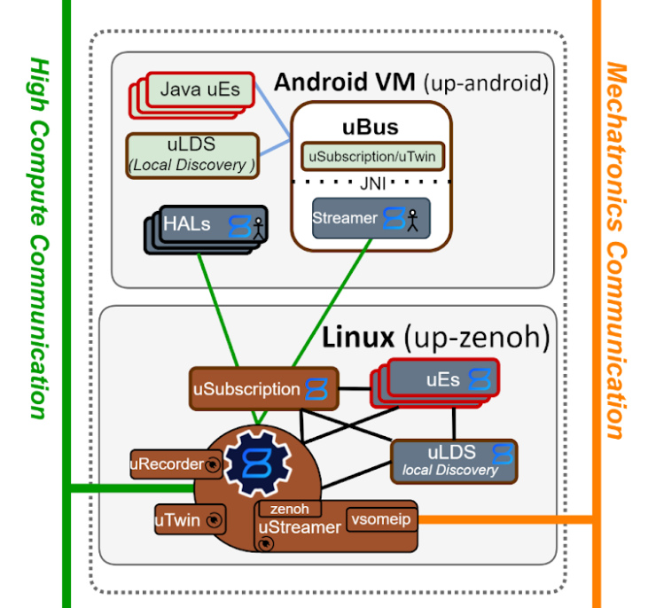

# Interop between Java and Rust for uProtocol uStreamer

I really enjoy working on projects where there's a chance to make a large impact and try to bring additional thoughts towards efficiency, safety, and robustness. Those are the same sorts of projects that tend to be early stage under rapid change and growth.

In this case, we were early on in [uProtocol](https://github.com/eclipse-uprotocol) scoping how the uStreamer would interact with or be incorporated with the uEntities running on the Android VM. Below is a snapshot in time of a more complete thought from the [uProtocol Roadmap](https://docs.google.com/document/d/1KIz5Jdg6uz7Cd31SElPn8oXyGyYRt_y0YFChX7FfKNg/edit?usp=sharing):



In the above topology we can see there is a uStreamer embedded into the uBus module serving uEntities' messages and it's fairly straight forward: a C++ [uP-L1 Zenoh transport](https://github.com/eclipse-uprotocol/up-transport-zenoh-cpp).

Before we arrived here, [Steven Hartley](https://github.com/stevenhartley) had considered an alternative formulation, where there was a Rust [uStreamer](https://github.com/eclipse-uprotocol/up-streamer-rust) which had plugged into it:

* a Rust [uP-L1 Zenoh Transport](https://github.com/eclipse-uprotocol/up-transport-zenoh-rust)
* a Rust [uP-L1 Android Binder Transport](https://github.com/PLeVasseur/up-client-android-rust/tree/feature/up-android-streamer)

And the Rust uStreamer would live within an [Android Service](https://github.com/PLeVasseur/up-android-example/tree/feature/up-android-streamer) which would pass in the necessary references to the [up-transport-android-java](https://github.com/eclipse-uprotocol/up-transport-android-java/tree/main)'s [`UPClient`](https://github.com/eclipse-uprotocol/up-transport-android-java/blob/17571d20e16e2be1bfc8f1caa0dd0bd71e74d73d/library/src/main/java/org/eclipse/uprotocol/UPClient.java#L100) Java object to be able to interact as if any other Java uEntity.

Big shoutout to [Mikhail Petrov](https://github.com/mishap4) for putting together all the Java uProtocol components like [up-android-core](https://github.com/eclipse-uprotocol/up-android-core), [up-transport-android-java](https://github.com/eclipse-uprotocol/up-transport-android-java), and [up-android-example](https://github.com/eclipse-uprotocol/up-android-example) in a clean way that's extensible!

Let's delve into a bit more detail how I went about this.

## The overall flow

As you step through the following sections, I think it's useful to have a visual to refer back to:


## The Android Service (uStreamerService)

### Java

To be frank with you, I haven't programmed in Java or for Android in a long while, so I took a tactical approach here of stripping down the already working [up-android-example](https://github.com/eclipse-uprotocol/up-android-example) and adapting it to do what I needed.

Here's the [core of the service](https://github.com/PLeVasseur/up-android-example/blob/d3f549b8f7844fc8a09016ebcb0487e2989552af/service/src/main/java/org/eclipse/uprotocol/streamer/service/UStreamerService.java#L188), where we're starting a new thread upon which to allow the uStreamer to run. I learned that we need to spawn this thread for the uStreamer to hold onto from the Java side, otherwise we lose the context of the JVM within the native Rust side.

```java
mUPClient.connect()
        .thenCompose(status -> {
            logStatus("connect", status);
            if (isOk(status)) {
                subscribe(RESOURCE_URI_TO_RUST);

                Thread thread = new Thread(() -> {
                    Thread.currentThread().setContextClassLoader(getClass().getClassLoader());
                    ClassLoader necessaryClassLoader = getClass().getClassLoader();
                    NativeBridge.initializeStreamer(mUPClient, mUSubscriptionStub, UUri.class,
                            UStatus.class, UListenerNativeBridge.class,
                            NativeBridge.class, necessaryClassLoader);
                });
                thread.start();
            }
            return isOk(status) ?
                    CompletableFuture.completedFuture(status) :
                    CompletableFuture.failedFuture(new UStatusException(status));
        });
    }
```

Let's take a further look at [`NativeBridge::initializeStreamer()`](https://github.com/PLeVasseur/up-android-example/blob/feature/up-android-streamer/service/src/main/java/org/eclipse/uprotocol/streamer/service/NativeBridge.java#L12).

```java
public class NativeBridge {
    public static native String initializeStreamer(UPClient client, USubscription.Stub uSubscription,
                                                   Class<?> UUriClass, Class<?> UStatusClass,
                                                   Class<?> UListenerNativeBridgeClass,
                                                   Class<?> NativeBridgeClass, ClassLoader necessaryClassLoader);

    public static native String teardownStreamer();

    public static UUri deserializeToUUri(byte[] uuri) throws InvalidProtocolBufferException {
        return UUri.parseFrom(uuri);
    }

    public static UMessage deserializeToUMessage(byte[] message) throws InvalidProtocolBufferException {
        return UMessage.parseFrom(message);
    }

    public static byte[] serializeFromUStatus(UStatus data) {
        return data.toByteArray();
    }

    static {
        // This actually loads the shared object that we'll be creating.
        // The actual location of the .so or .dll may differ based on your
        // platform.
        System.loadLibrary("ustreamer_native_bridge");
    }
}
```

### Rust

We have a Rust native function [`initializeStreamer`](https://github.com/PLeVasseur/up-android-example/blob/b86e447bad58d6932f78a9a1e74e1914aa77a53f/service/src/main/rust/ustreamer_native_bridge/src/lib.rs#L35) that we call.

For the bindings between Rust and Java I used the excellent [jni](https://crates.io/crates/jni) crate. Docs are in great shape and allowed me to do all of what I wanted just by reading through them.

Be forewarned, some of the following will look gnarly however.

Here we have the Rust implementation of the initializeStreamer function, with a very mangled name as required by JNI.

(Note that I will sometimes include a comment beginning `PELE` to indicate a section of interest or explanation)

```rust
// This keeps Rust from "mangling" the name and making it unique for this
// crate.
#[no_mangle]
pub extern "system" fn Java_org_eclipse_uprotocol_streamer_service_NativeBridge_initializeStreamer<
    'local,
>(
    mut env: JNIEnv<'local>,
    // This is the class that owns our static method. It's not going to be used,
    // but still must be present to match the expected signature of a static
    // native method.
    class: JClass<'local>,
    // PELE: The UPClient Java object
    up_client: JObject,
    // PELE: The USubscription Java object
    usub: JObject, 
    // PELE: The Java UUri class used later within `up-transport-android-rust`
    uuri_class: JClass, 
    // PELE: The Java UStatus class used later within `up-transport-android-rust`
    ustatus_class: JClass, 
    // PELE: The Java UListener class later used within `up-transport-android-rust`
    ulistener_native_bridge_class: JClass, 
    // PELE: The Java NativeBridge class later used within `up-transport-android-rust`
    native_bridge_class: JClass
) -> jstring {

    // ... continued below ...

}
```

And within the body of `initializeStreamer()` we [convert the local Java object references to global](https://github.com/PLeVasseur/up-android-example/blob/b86e447bad58d6932f78a9a1e74e1914aa77a53f/service/src/main/rust/ustreamer_native_bridge/src/lib.rs#L57C1-L63C57) so that we can later store these references within the Rust `up-transport-android-rust`:

```rust
    // Convert local references to global references
    let up_client = env
        .new_global_ref(up_client)
        .expect("Failed to create global ref for up_client");
    let usub = env
        .new_global_ref(usub)
        .expect("Failed to create global ref for usub");
```

And we do the same for the [class references](https://github.com/PLeVasseur/up-android-example/blob/b86e447bad58d6932f78a9a1e74e1914aa77a53f/service/src/main/rust/ustreamer_native_bridge/src/lib.rs#L65-L68):

```rust
    let uuri_class = env.new_global_ref(uuri_class).expect("Failed to create global ref for uuri_class");
    let ustatus_class = env.new_global_ref(ustatus_class).expect("Failed to create global ref for ustatus_class");
    let ulistener_native_bridge_class = env.new_global_ref(ulistener_native_bridge_class).expect("Failed to create global ref for ulistener_native_bridge_class");
    let native_bridge_class = env.new_global_ref(native_bridge_class).expect("Failed to create global ref for native_bridge_class");
```

We [obtain a `JavaVM` from the `JNIEnv`](https://github.com/PLeVasseur/up-android-example/blob/b86e447bad58d6932f78a9a1e74e1914aa77a53f/service/src/main/rust/ustreamer_native_bridge/src/lib.rs#L70-L71) we were passed in when calling `initializeStreamer()`:

```rust
    // Obtain the JavaVM from the JNIEnv
    let vm = env.get_java_vm().expect("Failed to get JavaVM");
```

We then [construct a `UPClientAndroid`](https://github.com/PLeVasseur/up-android-example/blob/b86e447bad58d6932f78a9a1e74e1914aa77a53f/service/src/main/rust/ustreamer_native_bridge/src/lib.rs#L76), passing in all of the global references we have made:

(we went through a naming change from `UPClientFoo` to `UPTransportFoo` after this code was written)

```rust
        let up_client_android = task::block_on(UPClientAndroid::new(vm, up_client, usub, uuri_class, ustatus_class, ulistener_native_bridge_class, native_bridge_class));
```

We [then](https://github.com/PLeVasseur/up-android-example/blob/b86e447bad58d6932f78a9a1e74e1914aa77a53f/service/src/main/rust/ustreamer_native_bridge/src/lib.rs#L78-L93) create a `dummy_uuri` upon which we will listen and the `dummy_listener` which will be pinged when a message comes through matching the `dummy_uuri`:

```rust
        let dummy_uuri = UUri {
            // ... snip ...
        };

        let dummy_listener = Arc::new(DummyListener);
```

We then [call `register_listener()`](https://github.com/PLeVasseur/up-android-example/blob/b86e447bad58d6932f78a9a1e74e1914aa77a53f/service/src/main/rust/ustreamer_native_bridge/src/lib.rs#L94) on the `up_client_android`, passing in the `dummy_uuri` and `dummy_listener`:

```rust
        let register_res = task::block_on(up_client_android.register_listener(dummy_uuri, dummy_listener));
```

And that's it for the UStreamerService for now. Let's move on to `up-transport-android-rust`.

## The uP-L1 Android Binder Rust Transport

We here again make use of the jni crate for the interop with the Java objects and classes we were passed in.

To [initialize](https://github.com/PLeVasseur/up-client-android-rust/blob/1dcfee3c0a6b4feeda9c8b858e20e8d7069d82f3/src/lib.rs#L10-L38) a `UPClientAndroid` we pass in the `JavaVM` and all the `GlobalRef`s from the `UStreamerService`:

```rust
pub struct UPClientAndroid {
    vm: JavaVM,
    up_client: GlobalRef,
    usub: GlobalRef,
    uuri_class: GlobalRef,
    ustatus_class: GlobalRef,
    ulistener_native_bridge_class: GlobalRef,
    native_bridge_class: GlobalRef,
}


impl UPClientAndroid {
    pub async fn new(vm: JavaVM, up_client: GlobalRef, usub: GlobalRef, uuri_class: GlobalRef,
    ustatus_class: GlobalRef, ulistener_native_bridge_class: GlobalRef, native_bridge_class: GlobalRef) -> Self {
        trace!(
            "{}:{} Able to instantiate UPClientAndroid",
            UPCLIENTANDROID_TAG,
            UPCLIENTANDROID_FN_NEW_TAG
        );
        Self {
            vm,
            up_client,
            usub,
            uuri_class,
            ustatus_class,
            ulistener_native_bridge_class,
            native_bridge_class
        }
    }
}
```

Let's take a look at how registering a listener works and the interplay between the Java and Rust parts of the code.

### Registering a Java UListener upon the `UPClientAndroid`

This is key because we'll need the ability to "hook up" between Android Binder from the Rust side into the uStreamer, allowing us to listen in on what's coming over Binder.

At a high level what happens here goes like this:

1. From Rust we call `register_listener()`, passing in Rust `UUri` and `UListener` objects
2. Within the `register_listener()` Rust function that's a part of the [uP-L1 UTransport spec](https://github.com/eclipse-uprotocol/up-spec/tree/main/up-l1#23-registerlistener), we then:
  1. Store the `UUri` struct and `UListener` trait object in a `HashMap` and `HashSet`, creating a hash `u64` value from the `UUri` and the memory address holding the `UListener`
  2. Create a [`UListenerNativeBridge`](https://github.com/PLeVasseur/up-android-example/blob/b86e447bad58d6932f78a9a1e74e1914aa77a53f/service/src/main/java/org/eclipse/uprotocol/streamer/service/UListenerNativeBridge.java#L6), passing in the hash `u64` so that later when the Java [`UListener::onReceive()`](https://github.com/eclipse-uprotocol/up-java/blob/8828840e8e7a5fdda847294633c6ac7c7b369cf0/src/main/java/org/eclipse/uprotocol/transport/UListener.java#L29) callback is pinged by the `UPClient` on a matching `UUri` [here](https://github.com/PLeVasseur/up-client-android-rust/blob/1dcfee3c0a6b4feeda9c8b858e20e8d7069d82f3/src/utransport.rs#L162-L192)
  3. Convert the Rust `UUri` object into a Java `UUri` object [here](https://github.com/PLeVasseur/up-client-android-rust/blob/1dcfee3c0a6b4feeda9c8b858e20e8d7069d82f3/src/utransport.rs#L201-L288)
  4. Call `registerListener()` on the Java `UPClient` object, passing in the Java `UListener` implementation of `UListenerNativeBridge` and the Java `UUri` [here](https://github.com/PLeVasseur/up-client-android-rust/blob/1dcfee3c0a6b4feeda9c8b858e20e8d7069d82f3/src/utransport.rs#L290-L325)
  5. We receive a Java `UStatus` object back and then convert that to a Rust `UStatus` object which we can then return [here](https://github.com/PLeVasseur/up-client-android-rust/blob/1dcfee3c0a6b4feeda9c8b858e20e8d7069d82f3/src/utransport.rs#L297-L405)

Later, when the Java `UPClient`'s registered `UListener` which matches the `UUri` is found:

1. The `UListenerNativeBridge`'s `onReceive()` function is called, which then in turn calls the `onReceiveNative` Rust function [here](https://github.com/PLeVasseur/up-android-example/blob/b86e447bad58d6932f78a9a1e74e1914aa77a53f/service/src/main/java/org/eclipse/uprotocol/streamer/service/UListenerNativeBridge.java#L16-L19)
2. [`onReceiveNative()`](https://github.com/PLeVasseur/up-client-android-rust/blob/1dcfee3c0a6b4feeda9c8b858e20e8d7069d82f3/src/utransport.rs#L60) is passed from Java the `u64` hash and the message in byte array format
  1. with the message in byte array format we are able to parse that into the Rust `UMessage` Protocol Buffers object [here](https://github.com/PLeVasseur/up-client-android-rust/blob/1dcfee3c0a6b4feeda9c8b858e20e8d7069d82f3/src/utransport.rs#L72-L78)
  2. with the `u64` hash we are then able to look up the stored Rust `UListener` [here](https://github.com/PLeVasseur/up-client-android-rust/blob/1dcfee3c0a6b4feeda9c8b858e20e8d7069d82f3/src/utransport.rs#L80-L81)
  3. we are then able to call the Rust `UListener`'s `on_receive()` function in order to act on the received `UMessage` which was as we recall received on the Java `UPClient`

## Experiments

I performed an experiment involving writing a rudimentary additional unit test for `up-client-android-java` which sent a message to the `UUri` matching the `dummy_uuri` and was able to see the text printed to the terminal which was set to do so within the `DummyListener` implementation.

Success!

## Wrapping up

While we ultimately ended up pivoting to a more straightforward design where the Java `UBus` uses a C++ `up-transport-zenoh-cpp` to communicate out over Zenoh to the non-Android VM portion of the host device, I learned a lot from doing this proof of concept.

It turns out that Java <-> Rust interop is made fairly simple (if with a bit of extra accounting / shims) by using the [jni](https://crates.io/crates/jni) crate. The jni crate even lets us fairly idiomatically check for and handle Java Exceptions as Rust Results in a way that feels reasonable.

