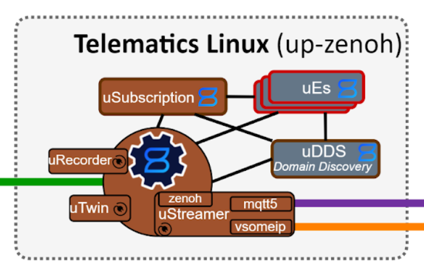

# Writing a Zenoh Plugin to house the uProtocol uStreamer

For [uProtocol](https://github.com/eclipse-uprotocol) we have a component in the [roadmap](https://docs.google.com/document/d/1KIz5Jdg6uz7Cd31SElPn8oXyGyYRt_y0YFChX7FfKNg/edit?usp=sharing) called a uStreamer which is responsible for bridging between different underlying [uP-L1 Transports](https://github.com/eclipse-uprotocol/up-spec/tree/main/up-l1).

According to the roadmap, we wanted the uStreamer to be housed within a [Zenoh](https://zenoh.io/) plugin to allow us to eventually use a shared memory mechanism to reduce copies on large message payloads (e.g. camera images).

## uStreamer's role in uProtocol



As shown in the above diagram, the uStreamer is an infra service which is responsible for "plugging" in uP-L1 Transports to allow communication between high-compute devices in-vehicle with hardened controllers in-vehicle and out to the cloud and mobile devices.

The MVP has us plugging in:

* up-transport-zenoh-rust - communication _from_ our host device
* up-transport-vsomeip-rust - communication _with_ the in-vehicle hardened controllers
* up-transport-mqtt5-rust - communication _with_ the cloud and mobile

## Implementation plan

I implemented this in three steps --

1. a [generic, pluggable library](https://github.com/PLeVasseur/up-streamer-rust/tree/main/up-streamer) to allow usage with any uP-L1 Transport
2. a [stand-alone binary](https://github.com/PLeVasseur/up-streamer-rust/tree/main/up-linux-streamer) with which I experiemented on functionality until moving on to...
3. a [Zenoh plugin](https://github.com/PLeVasseur/up-streamer-rust/tree/main/up-linux-streamer-plugin) with the uP-L1 Transport implementations we'd need for the above MVP topology

I may post a blog another time about the experience implementing the generic, pluggable library, but for now, let's move on to the Zenoh plugin.

## The Zenoh Plugin

### What's Zenoh?

[Zenoh](https://zenoh.io/) is the middleware the we chose in uProtocol to function as the primary "in-vehicle" transport. My experience with middleware is somewhat limited to ROS' a number of years ago and the one that was developed previously within General Motors.

From my point of view, Zenoh served as a nice, developer-friendly way to get data from A to B. Docs are excellent, code is very clean and easy to understand, and it's open source, so it's extensible and forkable. All great stuff.

Zenoh is also written [in Rust](https://crates.io/crates/zenoh), a programming language that I've been infatuated with since 2017 or so for its focus on reliability, efficiency, and safety.

They are nearing their 1.0.0 release, so check them out if you have a need for performant middleware.

### What's a Zenoh plugin?

The [docs](https://zenoh.io/docs/manual/plugins/) give a good overview, but if I had to explain it simply: it's a means of writing some software that will be given a Zenoh `Runtime` from which to create a Zenoh `Session` through which to then interact over the Zenoh middleware.

### Setting up

Truth be told, I had already implemented a Zenoh plugin six or so months prior, so this was not my first rodeo (but only my 2nd!).

I began as I did last time, by taking a look around for Zenoh docs, which led me to [this page](https://zenoh.io/docs/manual/plugins/) on their site. I then remembered from last time the docs not being detailed enough and that last time I just went and copy-pasted their [example plugin](https://github.com/eclipse-zenoh/zenoh/tree/main/plugins/zenoh-plugin-example).

I did the same this time, copy-pasting their Zenoh plugin folder into the [up-streamer-rust](https://github.com/eclipse-uprotocol/up-streamer-rust) Rust workspace crate and getting it compiling.


### Plan of attack

The idea was to:

1. copy-paste in the at-that-point fairly barebones core of `up-linux-streamer` into "some" correct spot
2. update the [Zenoh UTransport library]() to use the version which accepts a Zenoh Runtime
3. add configurations as necessary

In code snippets if you see `PELE` just know that's me giving some off-the-cuff comments about intention or discoveries.

#### 1. The correct spot

After reading through the example plugin, it appeared like the right spot was within the `run` function, where I would hollow out a spot to bring in the `up-linux-streamer` core functionality:

```rust
// The struct implementing the ZenohPlugin and ZenohPlugin traits
pub struct ExamplePlugin {}

// ... ommitting details about .so generation ...

impl ZenohPlugin for ExamplePlugin {}
impl Plugin for ExamplePlugin {
    type StartArgs = Runtime; // PELE: we can define for ourselves here what to take as arguments, nifty
    type Instance = zenoh::plugins::RunningPlugin;

    // ... ommitting details about plugin name ...

    // The first operation called by zenohd on the plugin
    fn start(name: &str, runtime: &Self::StartArgs) -> ZResult<Self::Instance> {
        // ... ommitting details about configuration reading ...

        // a flag to end the plugin's loop when the plugin is removed from the config
        let flag = Arc::new(AtomicBool::new(true));
        // spawn the task running the plugin's loop
        // PELE: the below run function seems to be the ticket
        async_std::task::spawn(run(runtime.clone(), selector, flag.clone()));
        // return a RunningPlugin to zenohd
        Ok(Box::new(RunningPlugin(Arc::new(Mutex::new(
            RunningPluginInner {
                flag,
                name: name.into(),
                runtime: runtime.clone(),
            },
        )))))
    }
}

// ... ommitting details about RunningPlugin trait ...

async fn run(runtime: Runtime, selector: KeyExpr<'_>, flag: Arc<AtomicBool>) {

    // ... ommitting some setup details ...

    // Plugin's event loop, while the flag is true
    // PELE: Bingo -- here an infinite async loop is running, processing inputs
    //  I'll implement the uStreamer plugging in of transports in here
    while flag.load(Relaxed) {
        select!(
            // on sample received by the Subscriber
            sample = sub.recv_async() => {
                let sample = sample.unwrap();
                info!("Received data ('{}': '{}')", sample.key_expr, sample.value);
                stored.insert(sample.key_expr.to_string(), sample);
            },
            // on query received by the Queryable
            query = queryable.recv_async() => {
                let query = query.unwrap();
                info!("Handling query '{}'", query.selector());
                for (key_expr, sample) in stored.iter() {
                    if query.selector().key_expr.intersects(unsafe{keyexpr::from_str_unchecked(key_expr)}) {
                        query.reply(Ok(sample.clone())).res().await.unwrap();
                    }
                }
            }
        );
    }
}
```

Clearly it would be possible to write whatever async function we'd like to here to spawn and then gracefully shut down when told to do so.

#### 2. Updating the Zenoh UTransport library

I was working with [CY](https://github.com/evshary) as he had developed the [Zenoh uP-L1 UTransport](https://github.com/eclipse-uprotocol/up-transport-zenoh-rust) library.

I mentioned to CY in a PR [code review comment](https://github.com/eclipse-uprotocol/up-transport-zenoh-rust/pull/40#discussion_r1638275529) I left we would need the ability to initialize a `UPTransportZenoh` based on a Zenoh `Runtime` a few days prior.

He [came through](https://github.com/eclipse-uprotocol/up-transport-zenoh-rust/pull/49) with Zenoh `Runtime` initialization of `UPTransportZenoh` rapidly enough that I could then pull this in.

The updates here were not major, but to give a flavor:

```rust

async fn run(runtime: Runtime, selector: KeyExpr<'_>, flag: Arc<AtomicBool>) {

    // ... ommitting some configuration details ...

   UPTransportZenoh::new_with_runtime(runtime.clone(), streamer_uri)
      .await
      .expect("Unable to initialize Zenoh UTransport"), // other host transports can be added here as they become available
    });
}
```

#### 3. Adding configuration

Here again, I feel there could be a little more emphasis in the docs put on configuration, but maybe I was looking in the wrong places.

To get a feeling for how this works, I instead turned to other examples, in particular the [Zenoh MQTT plugin](https://github.com/eclipse-zenoh/zenoh-plugin-mqtt).

I can see that there's a [`DEFAULT_CONFIG.json5`](https://github.com/eclipse-zenoh/zenoh-plugin-mqtt/blob/main/DEFAULT_CONFIG.json5) with various configurations present, so I decide to check into the rest of the project and see how they perform this:

```rust
let config: Config = serde_json::from_value(plugin_conf.clone())
    .map_err(|e| zerror!("Plugin `{}` configuration error: {}", name, e))?;
```

So they are using [`serde_json`](https://crates.io/crates/serde_json) in order to read the config and they have defined what their `Config` struct looks like:

```rust
#[derive(Deserialize, Serialize, Debug, Clone)]
#[serde(deny_unknown_fields)]
pub struct Config {
    #[serde(
        default = "default_mqtt_port",
        deserialize_with = "deserialize_mqtt_port"
    )]
    pub port: String,
    #[serde(default)]
    pub scope: Option<OwnedKeyExpr>,
    // ... snip ...
}
```

So I do something similar and define the uStreamer [`Config`](https://github.com/eclipse-uprotocol/up-streamer-rust/blob/96179d1432f1f7063bb547608e960306f8afc854/up-linux-streamer-plugin/src/config.rs#L17-L66):

```rust
#[derive(Deserialize, Serialize, Debug, Clone)]
#[serde(deny_unknown_fields)]
pub struct Config {
    pub(crate) __required__: bool,
    pub(crate) up_streamer_config: UpStreamerConfig,
    pub(crate) streamer_uuri: StreamerUuri,
    pub(crate) usubscription_config: USubscriptionConfig,
    pub(crate) host_config: HostConfig,
    pub(crate) someip_config: SomeipConfig,
}


#[derive(Deserialize, Serialize, Debug, Clone)]
#[serde(deny_unknown_fields)]
pub struct UpStreamerConfig {
    pub(crate) message_queue_size: u16,
}

// ... snip ...
```

I may delve into these configurations and settings another time, but for now, let's move on.

### But, alas, trouble

I find that the [latest available](https://download.eclipse.org/zenoh/zenoh/latest/) Zenoh Router (`zenohd`) that's is compiled with [rustc 1.72.0](https://github.com/eclipse-zenoh/zenoh/blob/main/rust-toolchain.toml#L2) whereas we have several uStreamer dependencies which require a higher Minimum Stable Rust Version (MSRV), namely [up-rust](https://github.com/eclipse-uprotocol/up-rust/blob/f4109d1e5552934b6c7550bd29dd46fb06c93216/Cargo.toml#L31) and [up-transport-zenoh-rust](https://github.com/eclipse-uprotocol/up-transport-zenoh-rust/blob/3993807a84d372de81f24c6b6f6ef936d45acce0/Cargo.toml#L29).

I find this out through a somewhat cryptic error message and a core dump when I attempt to use the compiled uStreamer plugin with the binary release of `zenohd`. Rust does not have a stable ABI, so it would appear after some intense debugging that _some_, but not _all_ of the plugin features would work across rustc versions.

I moved on to compiling Zenoh from source to get a `zenohd` which was ABI-compatible with the plugin.

## All's well that ends well

After a few more hiccups along the way (including CY's recommendation investigate the `Cargo.lock` file when seeing more issues), we were in business!

The compiled plugin's `.so` was able to be loaded along with the configuration JSON5 file to configure the uStreamer.

The demo went off without a hitch to all of my fellow uProtocol contributors.
