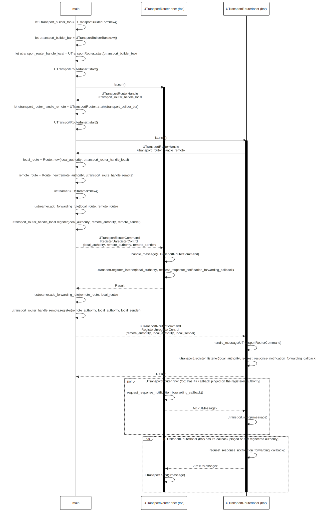
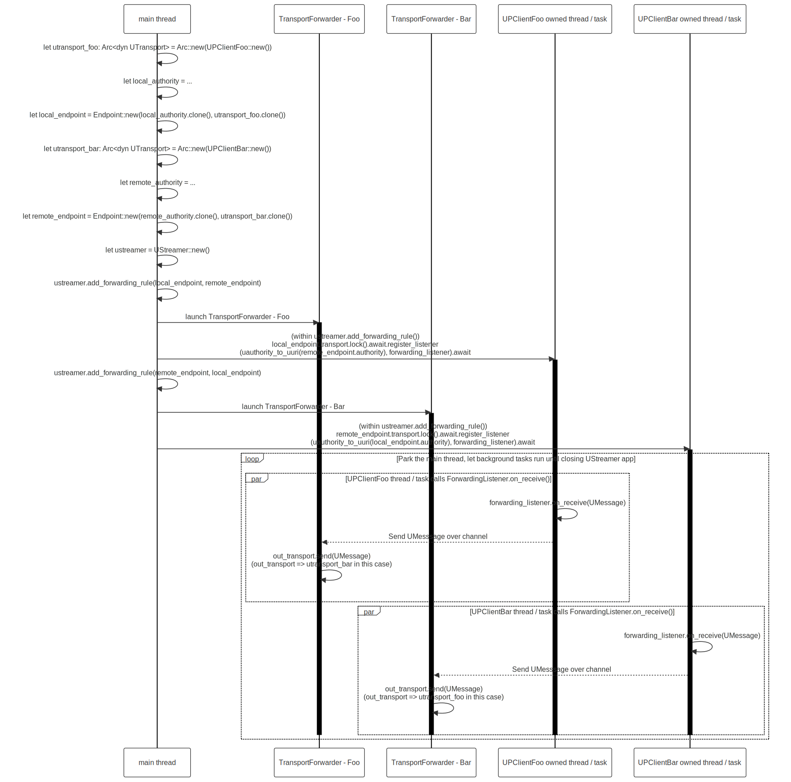

# Writing Async Rust for the uProtocol uStreamer

In [Eclipse uProtocol](https://github.com/eclipse-uprotocol) for the [Rust uStreamer](https://github.com/eclipse-uprotocol/up-streamer-rust) we needed to use some level of multi-threading or async in order to be given a UMessage from one uP-L1 Transport library and then send out over another.

I hadn't used Rust async before, so I thought this was a good opportunity to learn how it works. I read a few articles and then decided to implement the [generic, pluggable library](https://github.com/eclipse-uprotocol/up-streamer-rust/tree/main/up-linux-streamer) for the uStreamer using [`async-std`](https://docs.rs/async-std/latest/async_std/) because this was what the [Zenoh](https://zenoh.io/) middleware used (pre-1.0.0) so I had a little familiarity with it.

## The Architecture (take #1)

At the time, the [`up-rust`](https://github.com/eclipse-uprotocol/up-rust) `UTransport` and `UListener` traits were async traits, but they themselves were not `Send + Sync`. The problem with that is then that we cannot send either of these trait objects between threads.

This wrinkle complicated the original attempt at the architecture significantly, but _was_ good for learning with async Rust.

Because `UTransport` and `UListener` were not `Send + Sync` this led to a design that would looked like this for a user of the `up-streamer` crate:

```rust
// does not _initialize_ a UPTransportFoo, merely passes along configuration options
let foo_transport_builder = FooTransportBuilder::new(/* Foo-specific configuration options */);

// does not _initialize_ a UPTransportBar, merely passes along configuration options
let bar_transport_builder = BarTransportBuilder::new(/* Bar-specific configuration options */);

let ustreamer = UStreamer::new(/* initialization options */);

// inside of add_forwarding_rule UPTransportFoo and UPTransportBar are initialized
// on a dedicated thread for each
ustreamer.add_forwarding_rule(foo_transport_builder, bar_transport_builder);
```

Where essentially in addition to the various `up-transport-foo-rust` crates developed on top of the underlying protocol, e.g. [Zenoh](https://zenoh.io/) or [SOME/IP](https://some-ip.com/), we would have had to for each one write a `FooTransportBuilder` which knew how to build a `UPTransportFoo` based on configuration options.

### Diagram

The following is an .svg, so feel free to open in a new tab to zoom in and poke around. I'll be going into these details in a little bit in the next section.



#### Rust's safety guarantees

Fact is -- Rust the language wants us to be very explicit on what we are allowed to do with data in a program. The challenge I faced here with a `UTransport` trait which was not thread-safe is the kind of guard rails which can _seem_ annoying, but in reality are why I love working with Rust.

In another language, say C++, there's not a language-level concept to explain "this data is thread-safe", whereas in Rust there is. Frankly speaking, if I had been doing this in another language I can now imagine this leading to memory safety and thread safety issues if I were not extremely careful.

### `up-streamer` initialization of `up-transport-foo-rust`

The `up-streamer` was setup such that for each plugged in `FooTransportBuilder` there would then be a dedicated thread we spawn and then wait for commands on how to interact with the transport.

This looked something like the following. Here we can see the commands we can issue to a transport are written up as a Rust enum where we can encode the parameters needed for each command into the enum member.

```rust
enum TransportCommand {
  Send(Arc<UMessage>),
  RegisterListener(UUri, ComparableListener),
  UnregisterListener(UUri, ComparableListener)
}
```

Note that I wrote a `TransportBuilder` trait which would be implemented by each `UPTransportFoo` which wanted to plug into the streamer. This allowed for the streamer to only have to know about the very generic `build()` associated function when creating the transport and bake all the logic for how to intialize the transport into that function based on any configuration values for the transport.

```rust
async fn spawn_transport_thread_loop(transport_builder: Box<dyn TransportBuilder>, rx_cmd: Receiver<TransportCommand>) {
  thread.spawn({
    task.spawn({
      // PELE: Note here we initalize the transport on the dedicated thread
      let transport = transport_builder::build();

      while Ok(cmd) = rx_cmd.recv().await {
        match cmd {
          TransportCommand::Send(umsg) => {
            // ... skipping error handling for now ...
            transport.send(umsg).await;
          }
          TransportCommand::RegisterListener(topic, comp_listener) => {
            // ... skipping error handling for now ...
            transport.register_listener(topic, comp_listener.into_inner()).await;
          }
          TransportCommand::UnregisterListener(topic, comp_listener) => {
            // ... skipping error handling for now ...
            transport.unregister_listener(topic, comp_listener.into_inner()).await;
          }
        }
      }
    });
  });
}
```

### Propagating errors back through from dedicated thread

So it turns out that it's a little tricker then to propagate errors back through from that dedicated thread and we need to use something like the [`oneshot`](https://crates.io/crates/oneshot) crate in order to send back the status of the operation.

We need to update the enum to be able to propagate the error backward.

```rust
enum TransportCommand {
  Send(Arc<UMessage>, oneshot::Sender<Result<(), UStatus>>),
  RegisterListener(UUri, ComparableListener, oneshot::Sender<Result<(), UStatus>>),
  UnregisterListener(UUri, ComparableListener, oneshot::Sender<Result<(), UStatus>>)
}
```

We then need to update `spawn_transport_thread_loop()` so that we communicate the status back:

```rust
async fn spawn_transport_thread_loop(transport_builder: Box<dyn TransportBuilder>, rx_cmd: Receiver<TransportCommand>) {
  thread.spawn({
    // PELE: Note here we spawn onto the thread-local executor
    task.spawn_local({
      // PELE: Note here we initalize the transport on the dedicated thread
      let transport = transport_builder::build();

      while Ok(cmd) = rx_cmd.recv().await {
        let res = match cmd {
          TransportCommand::Send(umsg, res_one_shot) => {
            transport.send(umsg).await
          }
          TransportCommand::RegisterListener(topic, comp_listener, res_one_shot) => {
            transport.register_listener(topic, comp_listener.into_inner()).await
          }
          TransportCommand::UnregisterListener(topic, comp_listener, res_one_shot) => {
            transport.unregister_listener(topic, comp_listener.into_inner()).await
          }
        }
        if let Err(err) = res_one_shot.send(res) {
          log::error!("Unable to return result over oneshot");
        }
      }
    });
  });
}
```

After this attempt, I felt like a fair amount of unneeded additional complexity was being added to the uStreamer, so I discussed this in the uProtocol weekly meeting. After some discussion, we decided to make the `UTransport` and `UListener` traits `Send + Sync`, so I'd be able to simplify how we build and interact with `up-transport-foo-rust` uP-L1 uTransport libraries.

## The Architecture (take #2)

The next iteration I was able to strip out the need for having a thread dedicated to all manipulations of a transport and had a thread dedicated only to _sends_ over that transport, to ensure that we sequenced the output stream in the same ordering. Thanks to [Luca Cominardi](Luca Cominardi) of ZettaScale for the tip.

The following architecture is what's in the [v0.1.0 release of up-streamer-rust](https://github.com/eclipse-uprotocol/up-streamer-rust/releases/tag/v0.1.0).



I'll walk through some of the details on how it fits together.

### ForwardingListener

A [`ForwardingListener`](https://github.com/eclipse-uprotocol/up-streamer-rust/blob/4c233b72075f5e25b3ac149f6f5e597c329803fd/up-streamer/src/ustreamer.rs#L894) is registered with a `UTransport` trait object for the [`authority_name`](https://github.com/eclipse-uprotocol/up-spec/blob/da5ca97d3a7541d2fcd52ed010bc3bcca92e46cb/up-core-api/uprotocol/v1/uri.proto#L29) of the authority we want to forward messages _to_.

```rust
const FORWARDING_LISTENER_TAG: &str = "ForwardingListener:";
const FORWARDING_LISTENER_FN_ON_RECEIVE_TAG: &str = "on_receive():";

#[derive(Clone)]
pub(crate) struct ForwardingListener {
    forwarding_id: String,
    sender: Sender<Arc<UMessage>>,
}

impl ForwardingListener {
    pub(crate) fn new(forwarding_id: &str, sender: Sender<Arc<UMessage>>) -> Self {
        Self {
            forwarding_id: forwarding_id.to_string(),
            sender,
        }
    }
}

#[async_trait]
impl UListener for ForwardingListener {
    async fn on_receive(&self, msg: UMessage) {
        debug!(
            "{}:{}:{} Received message: {:?}",
            self.forwarding_id,
            FORWARDING_LISTENER_TAG,
            FORWARDING_LISTENER_FN_ON_RECEIVE_TAG,
            &msg
        );

        if msg.attributes.payload_format.enum_value_or_default()
            == UPayloadFormat::UPAYLOAD_FORMAT_SHM
        {
            debug!(
                "{}:{}:{} Received message with type UPAYLOAD_FORMAT_SHM, \
                which is not supported. A pointer to shared memory will not \
                be usable on another device. UAttributes: {:#?}",
                self.forwarding_id,
                FORWARDING_LISTENER_TAG,
                FORWARDING_LISTENER_FN_ON_RECEIVE_TAG,
                &msg.attributes
            );
            return;
        }
        if let Err(e) = self.sender.send(Arc::new(msg)).await {
            error!(
                "{}:{}:{} Unable to send message to worker pool: {e:?}",
                self.forwarding_id, FORWARDING_LISTENER_TAG, FORWARDING_LISTENER_FN_ON_RECEIVE_TAG,
            );
        }
    }
}
```

### TransportForwarder

A [`TransportForwarder`](https://github.com/eclipse-uprotocol/up-streamer-rust/blob/4c233b72075f5e25b3ac149f6f5e597c329803fd/up-streamer/src/ustreamer.rs#L840)'s role is to hold on to an `Arc<dyn UTransport>` and `Receiver<Arc<UMessage>>` so that any message intended to be sent out onto this transport can do so.

We start a dedicated thread and then do an async `task::block_on()`, within which we go into an infinite loop, waiting on `send()`s from the `Sender<Arc<UMessage>>` that we saw above in the `ForwardingListener`.

Note that since now the `UTransport` trait is `Send + Sync` we are able to put it in an `Arc`, cheaply clone it, and pass it around without having to dedicate a single thread to all interactions with it.

```rust
const TRANSPORT_FORWARDER_TAG: &str = "TransportForwarder:";
const TRANSPORT_FORWARDER_FN_MESSAGE_FORWARDING_LOOP_TAG: &str = "message_forwarding_loop():";
pub(crate) struct TransportForwarder {}

impl TransportForwarder {
    fn new(out_transport: Arc<dyn UTransport>, message_receiver: Receiver<Arc<UMessage>>) -> Self {
        let out_transport_clone = out_transport.clone();
        let message_receiver_clone = message_receiver.clone();

        thread::spawn(|| {
            task::block_on(Self::message_forwarding_loop(
                UUID::build().to_hyphenated_string(),
                out_transport_clone,
                message_receiver_clone,
            ))
        });

        Self {}
    }

    async fn message_forwarding_loop(
        id: String,
        out_transport: Arc<dyn UTransport>,
        message_receiver: Receiver<Arc<UMessage>>,
    ) {
        while let Ok(msg) = message_receiver.recv().await {
            debug!(
                "{}:{}:{} Attempting send of message: {:?}",
                id,
                TRANSPORT_FORWARDER_TAG,
                TRANSPORT_FORWARDER_FN_MESSAGE_FORWARDING_LOOP_TAG,
                msg
            );
            let send_res = out_transport.send(msg.deref().clone()).await;
            if let Err(err) = send_res {
                warn!(
                    "{}:{}:{} Sending on out_transport failed: {:?}",
                    id,
                    TRANSPORT_FORWARDER_TAG,
                    TRANSPORT_FORWARDER_FN_MESSAGE_FORWARDING_LOOP_TAG,
                    err
                );
            } else {
                debug!(
                    "{}:{}:{} Sending on out_transport succeeded",
                    id, TRANSPORT_FORWARDER_TAG, TRANSPORT_FORWARDER_FN_MESSAGE_FORWARDING_LOOP_TAG
                );
            }
        }
    }
}
```

There's a remaining bit of book-keeping and orchestration to hook up and get data flowing from `UPTransportFoo` to `UPTransportBar` over the `ForwardingListener` to the `TransportForwarder` that I'll [link to here](https://github.com/eclipse-uprotocol/up-streamer-rust/blob/4c233b72075f5e25b3ac149f6f5e597c329803fd/up-streamer/src/ustreamer.rs#L683-L687).

### An Endpoint

There's a type we define, an [`Endpoint`](https://github.com/eclipse-uprotocol/up-streamer-rust/blob/4c233b72075f5e25b3ac149f6f5e597c329803fd/up-streamer/src/endpoint.rs#L89-L94), which looks like this:

```rust
#[derive(Clone)]
pub struct Endpoint {
    pub(crate) name: String,
    pub(crate) authority: String,
    pub(crate) transport: Arc<dyn UTransport>,
}
```

We `streamer.add_forwarding_rule(endpoint_biz, endpoint_baz)` when we're adding forwarding rules without a need to use the `TransportBuilder` trait from earlier, since now the `UTransport` trait is `Send + Sync`.

## `up-linux-streamer`

By way of reference on how we use the `up-streamer` library crate, I wrote a [`up-linux-streamer`](https://github.com/eclipse-uprotocol/up-streamer-rust/tree/main/up-linux-streamer) application which is used to enable the in-vehicle topology for communicating between high-compute devices and mechatronics devices (think e.g. brake controller or IMU).

I'll show some snippets to give a flavor of on how we can now use the `up-streamer` crate to flexibly build different uStreamer configurations.

[Here](https://github.com/eclipse-uprotocol/up-streamer-rust/blob/4c233b72075f5e25b3ac149f6f5e597c329803fd/up-linux-streamer/src/main.rs#L64-L71) we build the `UStreamer`:

```rust
    let mut streamer = match UStreamer::new(
        "up-linux-streamer",
        config.up_streamer_config.message_queue_size,
        usubscription,
    ) {
        Ok(streamer) => streamer,
        Err(error) => panic!("Failed to create uStreamer: {}", error),
    };
```

[Next](https://github.com/eclipse-uprotocol/up-streamer-rust/blob/4c233b72075f5e25b3ac149f6f5e597c329803fd/up-linux-streamer/src/main.rs#L102-L112) we initialize the host transport and host `Endpoint`:

```rust
    let host_transport: Arc<dyn UTransport> = Arc::new(match config.host_config.transport {
        HostTransport::Zenoh => UPTransportZenoh::new(zenoh_config, streamer_uri)
            .await
            .expect("Unable to initialize Zenoh UTransport"), // other host transports can be added here as they become available
    });


    let host_endpoint = Endpoint::new(
        "host_endpoint",
        &config.streamer_uuri.authority,
        host_transport.clone(),
    );
```

[We then](https://github.com/eclipse-uprotocol/up-streamer-rust/blob/4c233b72075f5e25b3ac149f6f5e597c329803fd/up-linux-streamer/src/main.rs#L141-L150) initialize the SOME/IP transport and mechatronics endpoint:

```rust
        // There will be at most one vsomeip_transport, as there is a connection into device and a streamer
        let someip_transport: Arc<dyn UTransport> = Arc::new(
            UPTransportVsomeip::new_with_config(
                host_uuri,
                &config.someip_config.authority,
                &someip_config_file_abs_path,
                None,
            )
            .expect("Unable to initialize vsomeip UTransport"),
        );

        let mechatronics_endpoint = Endpoint::new(
            "mechatronics_endpoint",
            &config.someip_config.authority,
            someip_transport.clone(),
        );
```

We [then add](https://github.com/eclipse-uprotocol/up-streamer-rust/blob/4c233b72075f5e25b3ac149f6f5e597c329803fd/up-linux-streamer/src/main.rs#L157C1-L171C10) directions for the forwarding rules:

```rust
        let forwarding_res = streamer
            .add_forwarding_rule(mechatronics_endpoint.clone(), host_endpoint.clone())
            .await;


        if let Err(err) = forwarding_res {
            panic!("Unable to add forwarding result: {err:?}");
        }


        let forwarding_res = streamer
            .add_forwarding_rule(host_endpoint.clone(), mechatronics_endpoint.clone())
            .await;


        if let Err(err) = forwarding_res {
            panic!("Unable to add forwarding result: {err:?}");
        }
```

## Testing and demonstration

We have [example use cases](https://github.com/eclipse-uprotocol/up-streamer-rust/tree/main/example-streamer-uses) showcasing:

* RPC
* PubSub

for Zenoh as client/service/publisher/subscriber and the same for vsomeip if you'd like to take the uStreamer for a spin.

