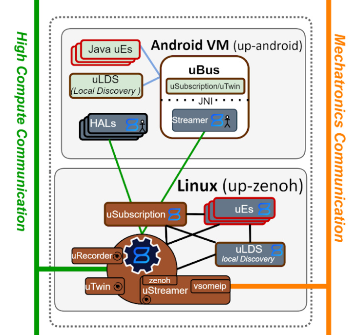
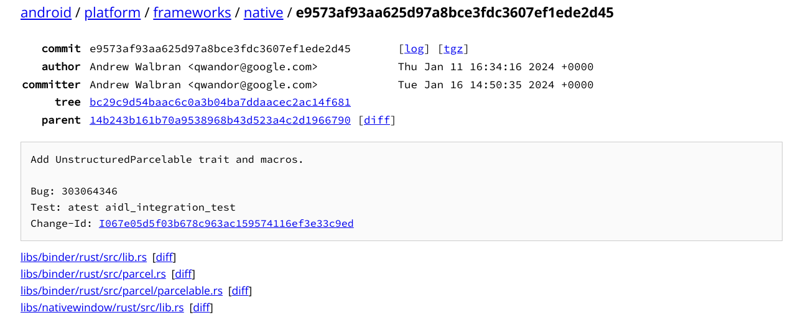

# Writing Rust for Android that communicates over Binder

As I recounted in an [earlier article](003-interop-java-rust.md), there were some fluctuations early on in how we would integrate the [Rust uStreamer](https://github.com/eclipse-uprotocol/up-streamer-rust) with uEntities running in the Android VM in [Eclipse uProtocol](https://github.com/eclipse-uprotocol).

The eventual topology that we arrived at is below, to recap:



Before then, however, we had considered having a uStreamer Rust native app run which would interact with the Android VM's UBus via [Android Binder](https://developer.android.com/reference/android/os/Binder).

The eventual show-stopper here and why we pivoted away from this approach is that the plan for the Android VM's UBus / [up-android-core](https://github.com/eclipse-uprotocol/up-android-core) was to _not_ run as an Android [`SystemService`](https://android.googlesource.com/platform/frameworks/base/+/master/services/core/java/com/android/server/SystemService.java), but as a more typical foreground or background service. One limitation of the Rust ability to [interact through Binder](https://android.googlesource.com/platform/frameworks/native/+/refs/heads/main/libs/binder/rust/src/binder.rs) is that it's only able to interact with other system services, of which the uStreamer would have been.

Let's take a stroll down memory lane going over what this first attempt looked like.

## Rust Binder Binding

Android Binder is essentially an IPC middleware used as the recommended means of communicating between apps and services in Android. Binder is also to communicate between system services in the [Android Open Source Project (AOSP)](https://source.android.com/), e.g. between a power management app and other apps on the device.

When I first chatted with [Steven Hartley](https://github.com/stevenhartley) about this approach, I had no real Android experience to speak of -- only an Android app I wrote way back in college.

I installed the [aosp](https://source.android.com/docs/setup/download) sources and started to read up on how Binder works.

Binder it seemed used a concept of an [AIDL (Android Interface Defintion Language)](https://source.android.com/docs/core/architecture/aidl) file to generate bindings for your language of choice to then be able to call functions remotely and define data payloads.

Looking a bit further into it, the [AIDL files](https://github.com/eclipse-uprotocol/up-transport-android-java/tree/main/library/src/main/aidl/org/eclipse/uprotocol/core/ubus) used by uProtocol in the Android VM side of things used [Custom Parcelables](https://github.com/eclipse-uprotocol/up-transport-android-java/tree/main/library/src/main/aidl/org/eclipse/uprotocol/v1/internal) (note the `ParcelableFoo` below -- those are Custom Parcelables).

```java
package org.eclipse.uprotocol.core.ubus;

import org.eclipse.uprotocol.core.ubus.IUListener;
import org.eclipse.uprotocol.v1.internal.ParcelableUEntity;
import org.eclipse.uprotocol.v1.internal.ParcelableUMessage;
import org.eclipse.uprotocol.v1.internal.ParcelableUStatus;
import org.eclipse.uprotocol.v1.internal.ParcelableUUri;

interface IUBus {
    ParcelableUStatus registerClient(in String packageName, in ParcelableUEntity entity, in IBinder clientToken, in int flags, in IUListener listener);
    ParcelableUStatus unregisterClient(in IBinder clientToken);
    ParcelableUStatus send(in ParcelableUMessage message, in IBinder clientToken);
    @nullable ParcelableUMessage[] pull(in ParcelableUUri uri, int count, in int flags, IBinder clientToken);
    ParcelableUStatus enableDispatching(in ParcelableUUri uri, in int flags, IBinder clientToken);
    ParcelableUStatus disableDispatching(in ParcelableUUri uri, in int flags, IBinder clientToken);
}
```

```java
package org.eclipse.uprotocol.core.ubus;

import org.eclipse.uprotocol.v1.internal.ParcelableUMessage;

interface IUListener {
    oneway void onReceive(in ParcelableUMessage event);
}
```

These Custom Parcelables are essentially just a bag of bytes into which we can read / write bytes to them.

### Rust Support

Amusingly, AOSP had [just added support](https://android.googlesource.com/platform/frameworks/native/+/e9573af93aa625d97a8bce3fdc3607ef1ede2d45) for these Custom Parcelables (called `UnstructuredParcelable` in the Rust version) about a month or so prior to my attempt:



### Attempt #1

Given what I had learned thus far it seemed as though interaction through Binder was exposed only through the AOSP, so I went ahead and attempted to get things rolling.

While I respect what Google is doing bringing Rust into AOSP and they even have some useful tools (like [Cargo Embargo](https://cs.android.com/android/platform/superproject/main/+/main:development/tools/cargo_embargo/)) to make this easier, I'll say that from my attempt here, trying to bring a Rust [Cargo](https://doc.rust-lang.org/cargo/) project to the AOSP's build system [Soong](https://source.android.com/docs/setup/build) is nothing short of challenging. To put this simply so you need not suffer as I did, I'll break it down.

Rust as an ecosystem of crates really embraces the [Unix philosophy](https://en.wikipedia.org/wiki/Unix_philosophy#:~:text=This%20is%20the%20Unix%20philosophy,that%20is%20a%20universal%20interface.):

> This is the Unix philosophy: Write programs that do one thing and do it well. Write programs to work together. Write programs to handle text streams, because that is a universal interface. 

(well all but the last bit, I suppose)

Therefore, it's very typical for a Rust library crate to depend upon _many other_ Rust library crates.

Bringing a single Rust crate that you know the inside and out of is not all that bad using the earlier mentioned `cargo-embargo`. There may be some tricky things, depending on what you're doing, but because it's your crate you can manage.

The issue is when we start to talk about needing to run `cargo-embargo` on the 10 or so library crates upon which your crate relies. And then each of those crates depends on 10-20 more and so on until you have _quite a lot_ of work on your hands.

In my case the tree exploded rather quickly and I found myself having to write special bash scripts to automate the download and conversion, walking the `cargo metadata` tree to download all the transitive dependencies, then manually adjust those that failed.

I think I got to somewhere near 100 dependencies after a day or so before I had to consider some alternative. The thought of [`up-rust`](https://github.com/eclipse-uprotocol/up-rust) bumping a version on a dependency or changing one dependency for another causing a ripple through 50 or more dependencies is what truly made me move on.

### Attempt #2

Searching around for an alternative, I found [`binder_rs`](https://github.com/Kernel-SU/binder_rs), which turned out to be the answer (mostly).

`binder_rs` put simply, is a copy-paste of the AOSP Rust Binder code, with some additional bindings exposed from `libbinder_ndk.so` to make us able to interact over Binder _without_ needing the AOSP. Now we're cooking.

All that's needed is:

* a `libbinder_ndk.so` we compile from any time beyond August or so of 2023 when initial support for Rust was added
* include `binder_rs` in our Cargo.toml

and we'd be good.

I did some initial tests on an Android VM and proved their examples worked.

Except! For the issue that support for `UnstructuredParcelable`s was added in January of 2024 (see screenshot above) and was not included in the AOSP copy + paste that was performed for `binder_rs`.

### Updating `libbinder_rs`

#### Adding support for `UnstructuredParcelable`s

This bit was honestly not all that difficult. I simply had to copy + paste a newer commit from the AOSP Rust Binder library in order to enable it.

I made an [example](https://github.com/PLeVasseur/binder_rs/tree/feature/add_jni_unstructured_parcelables/unstructured_parcelable_example) client and server in order to show that this is functional.

`client.rs`

```rust
use binder::Strong;
use crate::IMySimpleParcelableService::{IMySimpleParcelableService};
use crate::my_simple_parcelable::MySimpleParcelable;

pub fn run() -> anyhow::Result<()> {
    let my_service: Strong<dyn IMySimpleParcelableService> = binder::get_interface("myservice").unwrap();
    println!("Do sendMySimpleParcelable()");
    let name = "Franklin";
    let my_simplest_parcelable = my_service.sendMySimpleParcelable(name, 99 as i32).expect("Failed to retrieve simple parcelable");
    println!("Got simple parcelable: {:?}", my_simplest_parcelable);
    println!("Done!");
    Ok(())
}
```

`server.rs`

```rust
use binder::BinderFeatures;
use crate::IMySimpleParcelableService::{BnMySimpleParcelableService, IMySimpleParcelableService};
use crate::my_simple_parcelable::MySimpleParcelable;
use binder::{Interface, Result as BinderResult,
             binder_impl::{BorrowedParcel, UnstructuredParcelable},
};

pub struct MyService;

impl Interface for MyService {}

impl IMySimpleParcelableService for MyService {
    fn sendMySimpleParcelable(&self, name: &str, years: i32) -> BinderResult<MySimpleParcelable> {
        println!("sending simple parcelable for name: {} and years: {}", name, years);

        let my_simplest_parcelable = MySimpleParcelable {
            name: name.to_owned(),
            number: years
        };

        Ok(my_simplest_parcelable)
    }
}

pub fn run() -> anyhow::Result<()> {
    let my_service = MyService;
    let my_service_binder = BnMySimpleParcelableService::new_binder(my_service, BinderFeatures::default());
    binder::add_service("myservice", my_service_binder.as_binder())
        .expect("Failed to register service?");
    println!("Running!");
    binder::ProcessState::join_thread_pool();
    anyhow::Ok(())
}
```

There are some details on how to generate Rust code to interact through Binder by using AIDLs which are [documented further here](https://github.com/PLeVasseur/binder_rs/tree/feature/add_jni_unstructured_parcelables?tab=readme-ov-file#generate-rust-code-from-aidl-from-the-aosp).

It's at this point that I realized unfortunately that the `up-android-core` service would not be an Android system service, so I would be unable to interact with it using the uStreamer by specifying a string identifier, as is done when using the Rust Binder crate / `binder_rs`'s `binder::get_interface()`:

```rust
    let my_service: Strong<dyn IMySimpleParcelableService> = binder::get_interface("myservice").unwrap();
```

This leads to a further complication, which is that it's not possible to target an Intent via Binder with `binder_rs` / the NDK in general.

Shout-out to [Andrew Walbran](https://github.com/qwandor) for taking the time to answer a few emails to clarify this would not be possible.

So onto resolving that issue.

#### Converting a Java `IBinder` object into a Rust Strongly Typed Binder Object

Poking around a bit more I notice a few things:

* there's an NDK function, [`AIBinder_fromJavaBinder`](https://developer.android.com/ndk/reference/group/ndk-binder#aibinder_fromjavabinder), which will let me convert a Java `IBinder` object to a native `AIBinder` object
* the `binder_rs` / AOSP Rust Binder crate expose a function [`new_spibinder`](https://android.googlesource.com/platform/frameworks/native/+/refs/heads/main/libs/binder/rust/src/proxy.rs#141) which I can use to get an `SpIBinder` Rust object
* and then use the `binder_rs` / AOSP Rust Binder crate function [`into_interface`](https://android.googlesource.com/platform/frameworks/native/+/refs/heads/main/libs/binder/rust/src/proxy.rs#107) in order to convert the Binder object into a strongly-typed trait object representing the Binder interface on which we can directly call functions exposed.

So by combining these things, I would be able to:

1. Get an IBinder reference to a target Intent in Java and then
2. Pass this down into Rust code which would then
3. transform this Java `IBinder` object into a native `AIBinder` object and then
4. transform the `AIBinder` into a Rust `SpIBinder` object and lastly
5. into a trait object which has all the functions available as exposed over the AIDL

Let's look at these in turn:

##### From Java

The context this is run in is a [`UStreamerManager`](https://github.com/PLeVasseur/up-android-core/blob/e0422a560830e9bf1d0af7399b9acf12785ff6bd/service/src/main/java/org/eclipse/uprotocol/core/ustreamer/UStreamerManager.java#L27-L31) class which will bind to the UBus via the `Intent` of `uprotocol.action.BIND_UBUS`:

```java
public class UStreamerManager {

    private static final String TAG = "UStreamerManager";

    private final Context mContext;
    private boolean mServiceBound;

    public static final String ACTION_BIND_UBUS = "uprotocol.action.BIND_UBUS";

    private final ServiceConnection mServiceConnectionCallback = new ServiceConnection()  {

        @Override
        public void onServiceConnected(ComponentName componentName, IBinder iBinder) {
            Log.i(TAG, "inside mServiceConnectionCallback onServiceConnected()");
            // PELE: 2. Upon the service connected, we call UStreamerGlue.forwardJavaBinder(iBinder)
            //   to forward the IBinder object down into Rust
            Log.d(TAG, UStreamerGlue.forwardJavaBinder(iBinder));
        } 

        // ... snip ...

    }

    // PELE: 1. On connect we create the Intent and then attempt to bindService
    public boolean connect() {
        final Intent intent = new Intent(ACTION_BIND_UBUS);
        String mServiceConfig = "org.eclipse.uprotocol.core";
        intent.setPackage(mServiceConfig);
        Log.d(TAG, "intent: " + intent);
        mServiceBound = mContext.bindService(intent, mServiceConnectionCallback, BIND_AUTO_CREATE);
        Log.i(TAG, "Made it back from calling into Rust!");
        return mServiceBound;
    }
}
```

##### Into Rust

Then in the native Rust function [`forwardJavaBinder()`](https://github.com/PLeVasseur/up-android-core/blob/e0422a560830e9bf1d0af7399b9acf12785ff6bd/service/src/main/rust/ustreamer_bridge/src/lib.rs#L73) we do the remaining steps 3, 4, & 5:

```rust
// This keeps Rust from "mangling" the name and making it unique for this
// crate.
#[no_mangle]
pub extern "system" fn Java_org_eclipse_uprotocol_core_ustreamer_UStreamerGlue_forwardJavaBinder<'local>(mut env: JNIEnv<'local>,
// This is the class that owns our static method. It's not going to be used,
// but still must be present to match the expected signature of a static
// native method.
                                                     class: JClass<'local>,
                                                     binder: jobject) // PELE: The IBinder Java object
                                                     -> jstring {
```

Moving in further we make a [`JObject`](https://docs.rs/jni/latest/jni/objects/struct.JObject.html) and then make a global ref of it in a `OnceCell` called `JAVA_BINDER_INSTANCE` to hold onto as we loop.

```rust
    let binder_object = unsafe { JObject::from_raw(binder) };
    let binder_object_global_ref = env.new_global_ref(binder_object);
    let binder_object_global_ref = binder_object_global_ref.unwrap();
    JAVA_BINDER_INSTANCE.set(binder_object_global_ref.into()).unwrap_or_else(|_| panic!("Instance was already set!"));
```

We then 3. convert the `IBinder` object to a native `AIBinder` object.

```rust
    let aibinder = unsafe { binder_ndk_sys::AIBinder_fromJavaBinder(env.get_raw(), binder) };
```

Next, we 4. convert that `AIBinder` object to a Rust `SpIBinder` object.

```rust
    let spibinder = unsafe { new_spibinder(aibinder) };

    let spibinder_success = if spibinder.is_none() {
        "failed to get SpIBinder"
    } else {
        "got SpIBinder"
    };

    let spibinder = spibinder.unwrap();
```

(we use unwrap here in this POC code...)

Next, we 5. convert the `SpIBinder` object into a strongly-typed trait object `IUBus` representing the AIDL service:

```rust
    let ubus = Arc::new(spibinder.into_interface::<dyn IUBus>().expect("Unable to obtain strong interface"));
```

At this point we could then call functions shown in the `IUBus.aidl`, e.g. `registerClient()` and `send()`.

## Testing

I performed some very rudimentary tests to ensure that I was able to, from Rust, call functions on the `IUBus` trait object and receive status messages back from the UBus service, indicating that we were successful!

## Upstreaming the change

I opened a [PR](https://github.com/Kernel-SU/binder_rs/pull/7) on the `binder_rs` repo to upstream the additional features added:

* support for `UnstructuredParcelable`s
* support for converting a Java `IBinder` to a strongly-typed Rust trait object representing the proxy object

The PR appears to not have gotten noticed though. I tried to get in touch via email too.

Due to a pivot we made in how to integrate the uStreamer with the Android VM, this became non-critical, so I haven't had to fork the project.

## On to the next

I began to sketch in a rough draft of what such a [`up-client-android-rust`](https://github.com/PLeVasseur/up-client-android-rust/blob/feature/ustreamer-integration-check/up-client-android-rust/src/lib.rs) might look like, then got some feedback from [Mikhail Petrov](https://github.com/mishap4) I may be better off using a `up-transport-android-java` `UPClient` directly, as this would already handle service drops without my having to now handle this in the Rust code. His ideas gave rise to [the next approach](003-interop-java-rust.md) for integrating the uStreamer into the Android VM.

