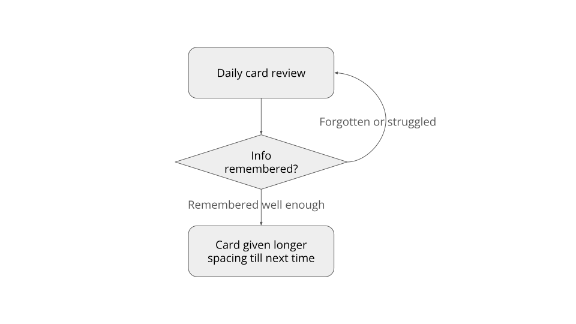
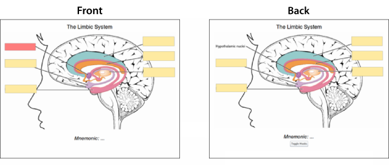

# The Power of Spaced-Repetition Systems for Learning and Retaining Knowledge

I had great success using a spaced-repetition system (SRS) and I'd love to share more about how they work and how to get started.

These spaced-repetition systems are well-known in some pockets of the immersion language learning community, particularly among Japanese language learners. They have been popularized fairly widely 2008 or so in that space, originating from the All-Japanese All the Time (AJATT) community (unfortunately gone dormant).

I've used SRS for both learning Japanese and picking up some engineering concepts I needed to learn for a new area.

But first! Onto how spaced-repetition systems (SRS) work.

## How spaced-repetition systems (SRS) work

The AJATT community was started by Khatzumoto where he outlined the method of using SRS for learning the ~2000 or so general purpose Japanese Kanji and for learning real-world Japanese sentences. Khatzumoto actually picked this methodology up from the excellent article written by a website written by some folks that learned English to an excellent level.

The [series of articles on antimoon](https://www.antimoon.com/how/srs.htm) are so complete I'd rather not reproduce them in their entirety! So I'll keep it fairly simple below and encourage you to read further on antimoon for more details.

Typical flashcard systems whether manual or using some app just show you the same cards over and over again, which can lead to annoyance and doesn't scale when you need to make hundreds or thousands of flashcards and review them over the course of years, potentially.

Spaced-repetition systems (SRS) work differently by using findings from neuroscience to show you cards at just the right moment when you might forget them, to strengthen your memory.

A key aspect is the daily review session for cards in your SRS deck:

* If you remembered the information on the card, you mark it as such in the SRS program so that the card is pushed or "spaced" further out. An example for a newly added card, it may be spaced between 2-5 days away to let you reach almost to that threshold of forgetting.
* If you didn't remember the information on the card or struggled you would mark the card appropriately and then you would likely immediately be shown the card again after reviewing the remainder of the cards.



## Spaced-repetition system (SRS) software

### Anki

I'm a big fan of [Anki](https://apps.ankiweb.net/) for how to do SRS in-practice. It's been around for a long time, seen lots of fixes and updates (a newer SRS algorithm landed a while back) and is very extensible to fit anyone's needs.

Anki is free on all major desktop platforms: Windows, MacOS, Linux. It's also free on Android, but for iOS you pay a one-time charge to use it (but well worth it to add cards and review on the go in my opinion).

### Others

Anki is what I always used, so frankly I'm less knowledgable, but some people also seem to really like [SuperMemo](https://www.supermemo.com/en). SuperMemo is actually what the antimoon folks [used](https://www.antimoon.com/how/tomandsm.htm) back in the 90's when learning English. However, given that Anki is [open source](https://github.com/ankitects/anki) while SuperMemo has a [long history](https://supermemo.guru/wiki/Open_source_SuperMemo) of community efforts to open source it, I'd recommend starting with Anki.

## Effectiveness from personal experience

### Learning Japanese

Was I effective using Anki along with immersion learning? I'd say so. Not that tests are perfect for finding out ability but: I didn't studied once and passed the [Japanese Language Proficiency Test N1](https://www.jlpt.jp/e/about/levelsummary.html) after about 3 years of very active study and 5 years in total.

### Learning a new engineering concept

Was I effective in learning a new engineering concept using SRS? Fair to say so I think. After doing both for about three months I was able to negotiate an offer with another company for a ~20% raise in base salary.

If you're just interested in how they work, you can stop here and general usefulness. If you'd like to learn more about some practical ways to apply them for learning languages and other concepts, read on!

## Ways to use spaced-repetition systems (SRS) based on personal experience

### Language learning (Japanese for my case)

I used SRS for about four years while learning Japanese for two main purposes:

* learning the ~2000 or so Japanese Kanji characters
* learning real-world Japanese sentences

This was coupled with learning Japanese via an immersion-learning approach similar to what's laid out in [Refold](https://refold.la/simplified/) (no affiliation, it's just a solid roadmap).

#### Japanese Kanji

I used the methodology described in James Heisig's book [Remembering the Kanji: Volume 1](https://www.amazon.com/Remembering-Kanji-Complete-Japanese-Characters/dp/0824835921/). The front of the card is the kanji character and the back is the _single_ meaning in your native language you're associating and the mnemonic chosen to help remember it. (Japanese kanji can have many meanings, but for our purposes we pick just one.)

After 200 kanji or so, Heisig leaves you to figure out your own mnemonics. If you'd like to not do that, [kanji koohii](https://kanji.koohii.com/) is a great resource where there's more than 15 years of folks uploading their mnemonics they came up with.

I learned of the above method and resources through the AJATT community.

#### Japanese real-world sentences

There are many potential ways do these, but I always used the class "sentence" cards where the front is a real-world native Japanese sentence and the back is dictionary definitions of new words:

* when starting out, your best attempt at an English translation (LLMs these days do a decent job), with Japanese-to-English translations of new words
* after 1000 or so sentences, no longer having an English translation and switching to use a monolingual Japanese dictionary

I learned of the above method through the AJATT community.

### Learning an engineering concept (Kalman filters)

A number of years back I needed to learn more about how Kalman filters worked while working on Automated Driving systems. I had a background in Computer Science, but not in how these worked.

I used [Kalman and Bayesian Filters in Python](https://github.com/rlabbe/Kalman-and-Bayesian-Filters-in-Python) (KBFP) as my resource for learning more about them. KBFP was super helpful as the book is structured as a [Jupyter Notebook](https://jupyter.org/), with interactive plots and figures you can manipulate to make the concepts stick.

Along with reading through KBFP, I started to use my SRS to make cards of a few varieties.

#### Cloze deletion cards

I would make [cloze deletion](https://docs.ankiweb.net/editing.html#cloze-deletion) cards based on definitions and surrounding text from KBFP. Pulling from the link in the previous sentence:

> Cloze deletion is the process of hiding one or more words in a sentence. For example, if you have the sentence:
> ```
> Canberra was founded in 1913.
> ```
> …​and you create a cloze deletion on “1913”, then the sentence would become:
> ```
> Canberra was founded in [...].
> ```

The neat thing about this style of Anki card is that you could have more that one clozure and you could generate many cards from a single entry to solidify knowledge.

#### Figure occlusion cards

I would take screenshot figures explaining concepts in KBFP and use the [Image Occlusion Enhanced
](https://ankiweb.net/shared/info/1374772155) Anki plugin to hide certain parts of figures I wanted to be tested on when making cards.



The neat thing about using the Image Occlusion Enhanced plugin like this is that for a given figure it's possible to generate many cards to solidify knowledge and also have it be in context.h

## Conclusion

Thanks for reading if you got this far. It's not an exaggeration to say that Spaced-Repetition Systems (SRS) have changed my life for the better and enriched it in ways that go far beyond this article.

I'm happy if even a handful of people read it, give it a try, and see its usefulness.
